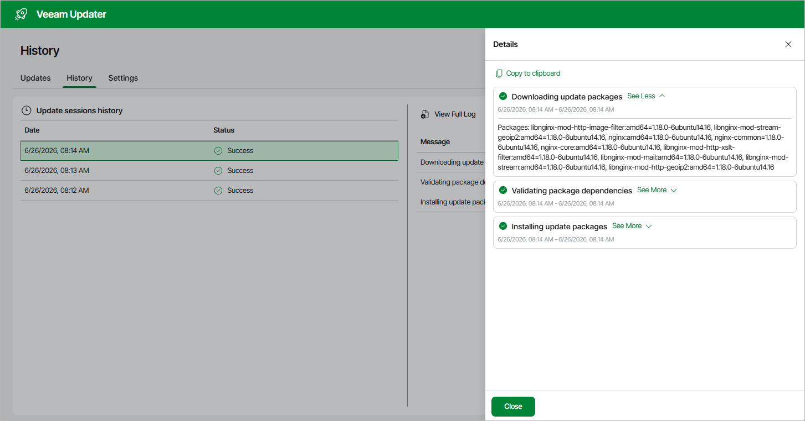

# Viewing Update History

To see the results of the update installation performed on the backup appliance, do the following:

1. Switch to the Configuration page.
2. Navigate to Support Information > Updates.
3. Click Check and View Updates.
4. On the Veeam Updater page, switch to the History tab.

For each date when an update was installed, the History tab displays the update session status — that is, whether the installation process completed successfully or failed to complete. To view the full list of packages installed during a specific session, select the necessary timestamp in the Date column and click View Details.

|  |
| --- |
| Tip |
| To download logs for for the installed updates, click View Full Log — the backup appliance will save the logs as a single file to the default download directory on the local machine. |

Page updated 2026-07-28

