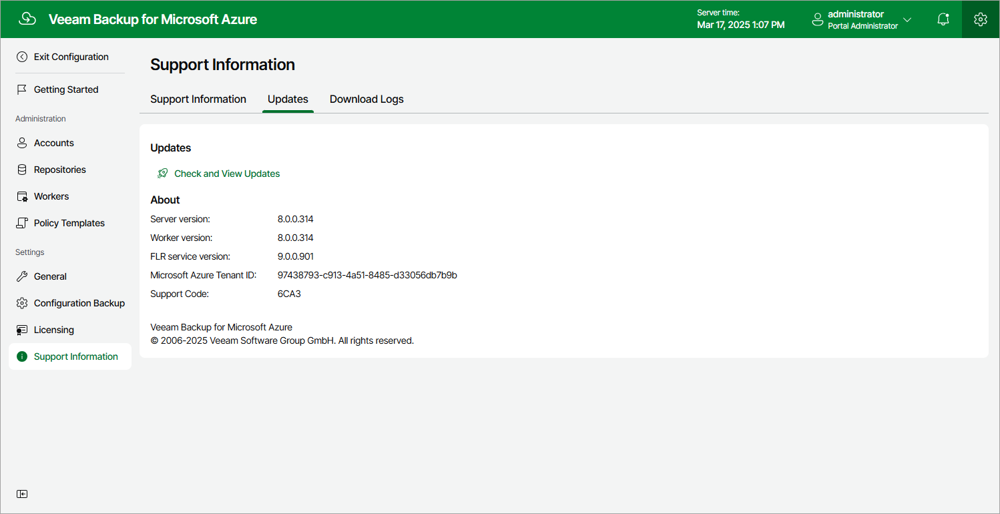
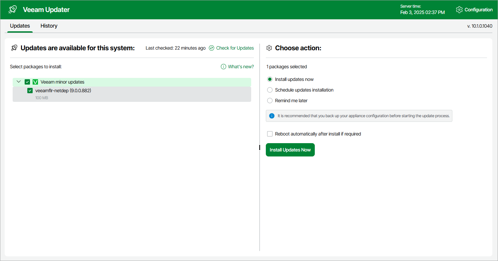

# Checking for Updates

The backup appliance automatically notifies you about newly released product versions, product updates and software package updates available for the operating system running on your backup appliance. However, you can check for the available updates manually if required:

1. Switch to the Configuration page.
2. Navigate to Support Information.
3. Switch to the Updates tab.
4. Click Check and View Updates.

If new updates are available, the backup appliance will display them on the Updates tab of the Veeam Updater page. To view detailed information on an update, select the check box next to the update and click What's new?

Related Topics

* [Installing Updates](azure_updates_install.md)
* [Viewing Update History](azure_update_history.md)

Page updated 2026-07-28

