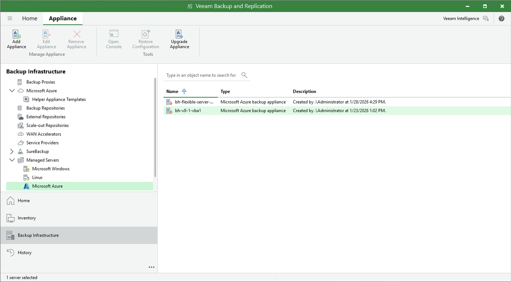

# Upgrading Backup Appliances

Veeam Backup for Microsoft Azure allows you to check for new product versions and available software package updates. It is recommended that you timely install available software package updates to avoid performance issues while working with the product. For example, timely installed security updates may help you prevent potential security issues and reduce the risk of compromising sensitive data.

Starting from Veeam Backup for Microsoft Azure version 5a, you can upgrade backup appliances from the Veeam Backup & Replication console only. Direct upgrade to Veeam Backup for Microsoft Azure version 13 is supported from Veeam Backup for Microsoft Azure version 6.0 or 7.0; to upgrade from an earlier version, you must first perform [upgrade to Veeam Backup for Microsoft Azure version 6.0 or 7.0](https://helpcenter.veeam.com/archive/vbazure/70/guide/upgrading_appliances_console.html).

Before You Begin

Before you start the upgrade process, consider the following requirements and limitations:

* The Veeam Backup for Microsoft Azure version must be compatible with the current version of Veeam Plug-in for Microsoft Azure. For more information, see [System Requirements](azure_system_requirements.md#compatibility).
* If your backup appliance used the Azure Service Bus messaging service in versions prior to version 13, you must switch to the Azure Queue Storage service in the appliance Web UI immediately after you upgrade to version 13. Otherwise, Veeam Backup for Microsoft Azure will no longer be able to perform backup and restore operations. For more information, see [Configuring Deployment Mode](azure_deployment_mode.md#messaging).
* The Microsoft Azure compute account (service account) specified when [deploying a backup appliance](azure_deploying_appliance_account.md) or [connecting to the appliance](azure_adding_appliance_account.md) must be assigned permissions required to perform upgrade. For the list of required permissions, see [Plug-In Permissions](azure_plugin_permissions.md).

* Outbound internet access must be allowed from the backup appliance to the PostgreSQL APT repository (apt.postgresql.org, apt-archive.postgresql.org) through port 80 over the HTTP protocol.

* Outbound internet access must be allowed from the backup appliance to the PostgreSQL website (postgresql.org) through port 443 over the HTTPS protocol to download the repository key <https://www.postgresql.org/media/keys/ACCC4CF8.asc>.
* Outbound internet access must be allowed from the backup appliance to the [Veeam Update Notification Server](https://repository.veeam.com/) through port 443 over the HTTPS protocol.
* Outbound internet access must be allowed from the backup appliance to the [Ubuntu Security Repository](https://ubuntu.com/security/notices) through port 80 over the HTTP protocol.

* During upgrade, the data disk of the backup appliance will temporarily contain files of 2 databases. That is why the size of the data disk must be twice the total amount of storage space used by the configuration database.

* During upgrade, Veeam Backup & Replication will create the new root virtual disk with the default settings. That is why if you have modified root disk settings, for example have increased disk size, these settings will not be transferred, and custom 3rd-party software installed on the backup appliance will not be migrated.

How to Perform Upgrade

To upgrade Veeam Backup for Microsoft Azure, do the following:

1. In the Veeam Backup & Replication console, open the Backup Infrastructure view.
2. Navigate to Managed Servers.
3. Select the necessary backup appliance and click Upgrade Appliance on the ribbon.

Alternatively, right-click the appliance and select Upgrade.

|  |
| --- |
| Note |
| As soon as you click Upgrade Appliance, Veeam Backup & Replication will verify connection to the specified backup appliance. If the appliance is assigned a dynamic IP address, you will receive a warning regarding the retirement of these IP addresses. To learn how to eliminate this warning, see [Eliminating Warnings](azure_eliminating_warnings.md). |

Page updated 2026-02-27

