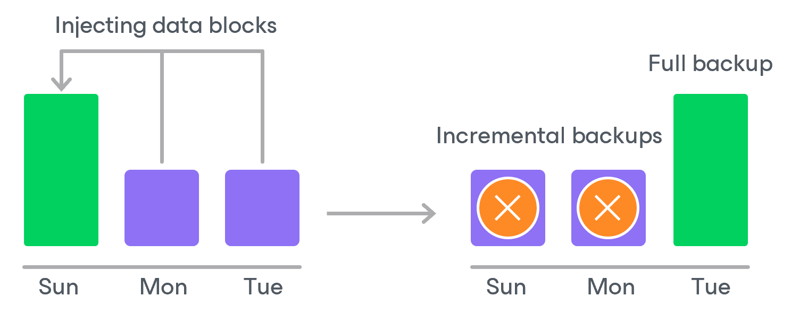

# VM Backup Retention

For image-level backups, backup appliances retain restore points for the number of days defined in backup scheduling settings as described in section [Creating VM Backup Policies](azure_vm_backup_policy_schedule.md).

To track and remove outdated restore points from a backup chain, the backup appliance performs the following actions once a day:

1. The backup appliance checks the configuration database to detect blob containers that contain outdated restore points.
2. If an outdated restore point exists in a blob container, the backup appliance deploys a worker instance in an Azure region in which the container with backed-up data resides.
3. Veeam Backup for Microsoft Azure transforms the backup chain in the following way:

1. The backup appliance rebuilds the full backup to include data of the incremental backup that follows the full backup. To do that, the appliance injects into the full backup data blocks from the earliest incremental backup in the chain. This way, the full backup ‘moves’ forward in the backup chain.

1. The backup appliance removes the earliest incremental backup from the chain as redundant — this data has already been injected into the full backup.

1. The backup appliance repeats step 2 for all other outdated restore points found in the backup chain until all the restore points are removed. As data from multiple restore points is injected into the rebuilt full backup, the appliance ensures that the backup chain is not broken and that you will be able to recover your data when needed.

Related Topics

[Retention Policy for Archived Backups](azure_vm_archive_backup_retention.md)

Page updated 2026-07-01

