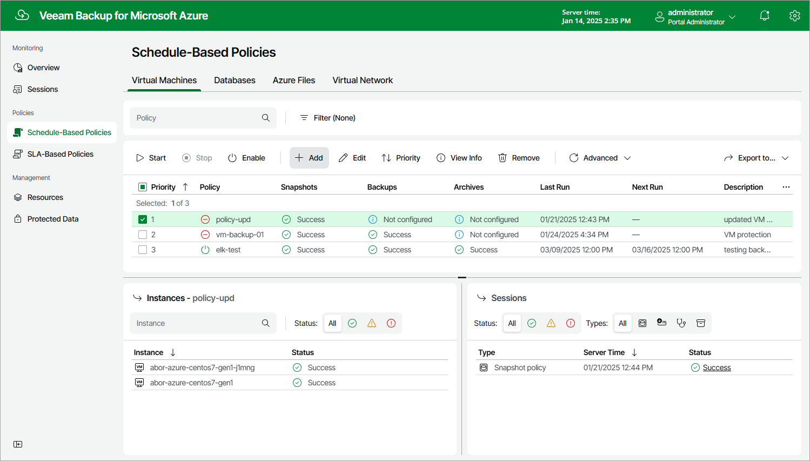

# Step 1. Launch Add VM Policy Wizard

To launch the Add VM Policy wizard, do the following:

1. Navigate to Schedule-Based Policies.
2. Switch to Virtual Machines.
3. Click Add.

Page updated 2025-03-17

