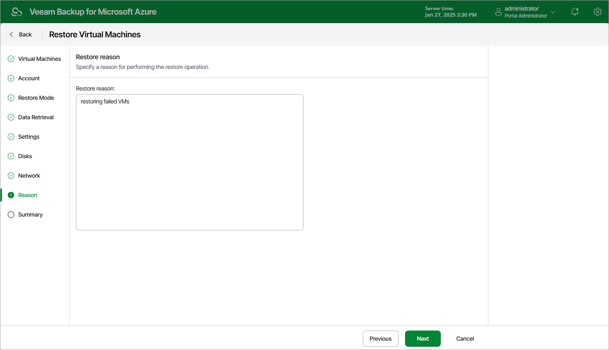

# Step 9. Specify Restore Reason

At the Reason step of the wizard, specify a reason for restoring the Azure VM. This information will be saved to the session history, and you will be able to reference it later.

Page updated 2024-02-02

