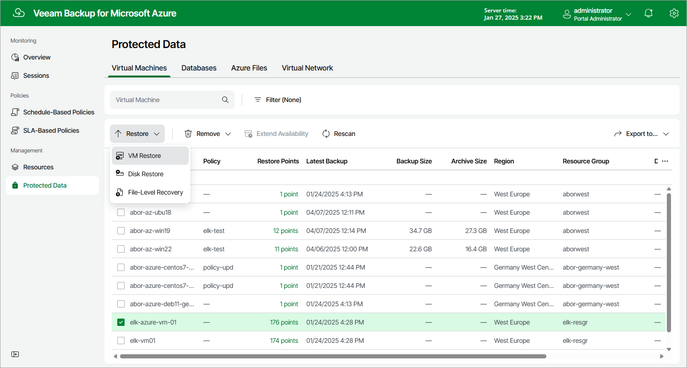

# Step 1. Launch Restore Virtual Machines Wizard

To launch the Restore Virtual Machines wizard, do the following:

1. Navigate to Protected Data > Virtual Machines.
2. Select the Azure VM that you want to restore.
3. Click Restore > VM Restore.

Alternatively, click the link in the Restore Points column. Then, in the Available Restore Points window, select the necessary restore point and click Restore > VM Restore.

Page updated 2025-03-17

