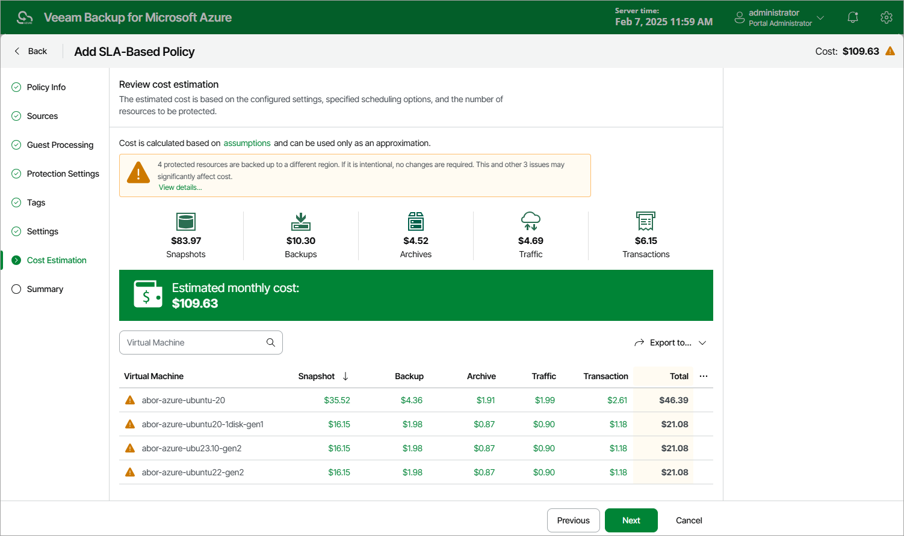

# Step 8. Review Estimated Cost

[This step applies only if you have selected an SLA template with backups enabled at the Protection Settings step of the wizard]

At the Cost Estimation step of the wizard, review the approximate monthly cost of Azure services that Veeam Backup for Microsoft Azure will require to protect the Azure VMs added to the SLA-based backup policy. The total estimated cost includes the following:

* The cost of creating and maintaining snapshots of the Azure VMs.

For each Azure VM included in the SLA-based backup policy, the backup appliance takes into account the total size of virtual disks attached, the number of restore points to be kept in the snapshot chain, and the configured scheduling settings.

* The cost of creating and maintaining image-level backups of the Azure VMs.

For each Azure VM included in the SLA-based backup policy, the backup appliance takes into account the total size of virtual disks attached, the number of restore points to be kept in the backup chain, and the configured scheduling settings.

* The cost of transferring Azure VM data between Azure regions during data protection operations (for example, if a protected Azure VM and the target storage account reside in different regions).

If you get a warning message regarding additional costs associated with cross-region data transfer, you can click View details to see available cost-effective options.

* The cost of making API requests to Microsoft Azure during data protection operations.

|  |
| --- |
| Note |
| To calculate the estimated cost, the backup appliance uses the capabilities of the [Azure Pricing Calculator](https://azure.microsoft.com/en-us/pricing/calculator/) that estimates the cost of services in USD only. This calculator is intended for informational and estimation purposes only. |

The estimated cost may occur to be significantly higher due to the backup frequency, cross-region data transfer and snapshot charges. To reduce the cost, you can try the following workarounds:

* To avoid additional costs related to cross-region data transfer, select a repository that resides in the same region as Azure VMs that you plan to back up.

* To reduce high snapshot charges, adjust the snapshot retention settings to keep less restore points in the snapshot chain.
* To optimize the cost of storing backups, modify the scheduling settings to run the SLA-based backup policy less frequently, or specify an archive repository for long-term retention of restore points.

Page updated 2026-07-01

