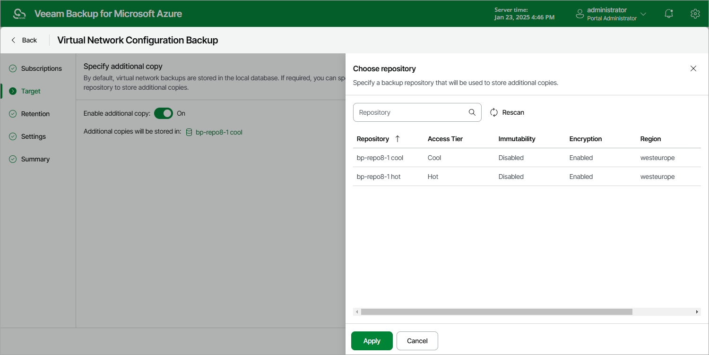

# Step 3. Enable Additional Backup Copy

By default, the backup appliance stores virtual network configuration backups in the local database. You can instruct the backup appliance to save additional backup copies to a repository. To do that:

1. At the Target step of the wizard, set the Enable additional copy toggle to On.
2. In the Choose repository window, select a repository that will be used to store the additional virtual network configuration backup copies.

For a backup repository to be displayed in the list of available repositories, it must be added to the backup appliance as described in section [Adding Backup Repositories](azure_repository_add_ui.md) or [Adding Storage Vaults](azure_repository_vdc_add_ui.md). The list shows only backup repositories of the Hot and Cool access tiers.

1. To save changes made to the backup policy settings, click Apply.

|  |
| --- |
| Note |
| When choosing a backup repository, consider the following:   * If you want to encrypt the backed-up virtual network configuration data, select a repository with encryption enabled. * If you want to make the backed-up virtual network configuration data immutable for the period specified in [retention settings](azure_vnet_backup_retention.md) of the backup policy, select a repository with immutability enabled. Note that the backup appliance does not apply generations to virtual network configuration backups.   For more information on encryption and immutability, see [Managing Repositories](azure_repositories.md). |

Page updated 2026-07-01

