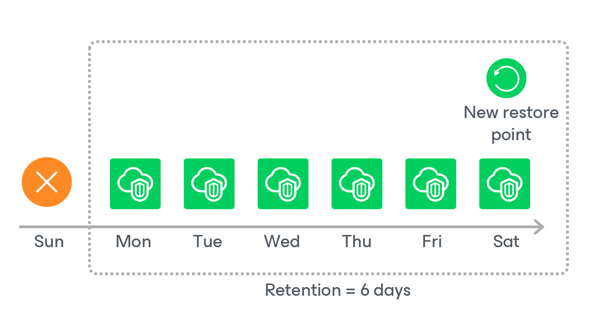

# Step 4. Configure Retention Settings

At the Retention step of the wizard, specify retention settings for virtual network configuration backups.

1. Click the Collect data link.
2. In the Daily retention window, specify how often the data will be backed up and for how long the backups will be stored in the Veeam Backup for Microsoft Azure configuration database.

If a restore point is older than the specified time limit, the backup appliance removes the restore point from the backup chain. For more information, see [Virtual Network Configuration Backup Retention](azure_retention_backup_vnet.md).

Page updated 2026-07-01

