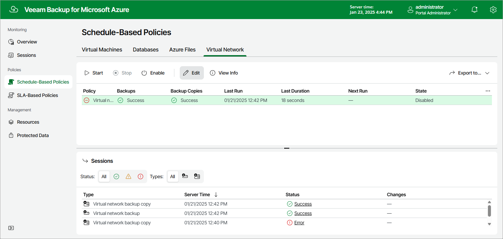

# Step 1. Launch Virtual Network Configuration Backup Wizard

To launch the Virtual Network Configuration Backup wizard, do the following:

1. Navigate to Policies > Virtual Network.
2. Click Edit.

Page updated 2025-03-13

