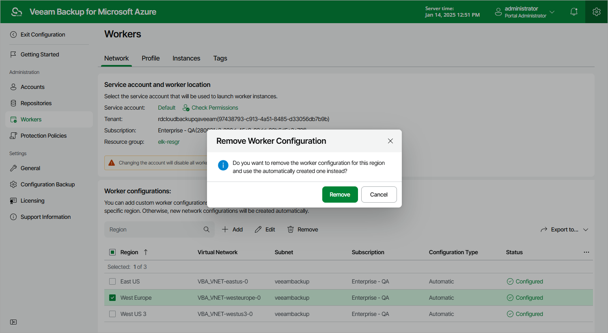

# Removing Worker Configurations

The backup appliance allows you to permanently remove worker configurations if you no longer need them. When you remove a worker configuration, the backup appliance does not remove currently running worker instances that have been created based on this configuration — these instances are removed only when the related operations complete.

To remove a worker configuration from the backup appliance, do the following:

1. Switch to the Configuration page.
2. Navigate to Workers > Network.
3. Select the worker network configuration and click Remove.

Page updated 2026-07-01

