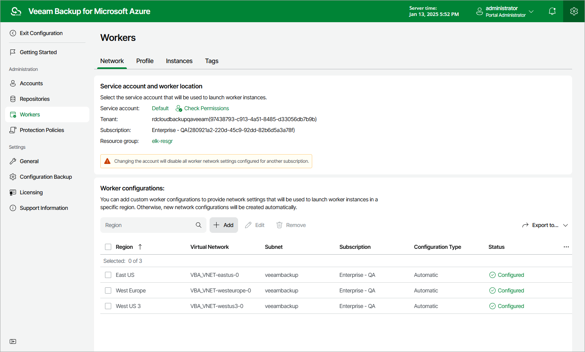

# Step 1. Launch Add Worker Network Configuration Wizard

To launch the Add Worker Network Configuration wizard, do the following:

1. Switch to the Configuration page.
2. Navigate to Workers > Network.
3. In the Worker configurations section, click Add.

Page updated 2025-10-24

