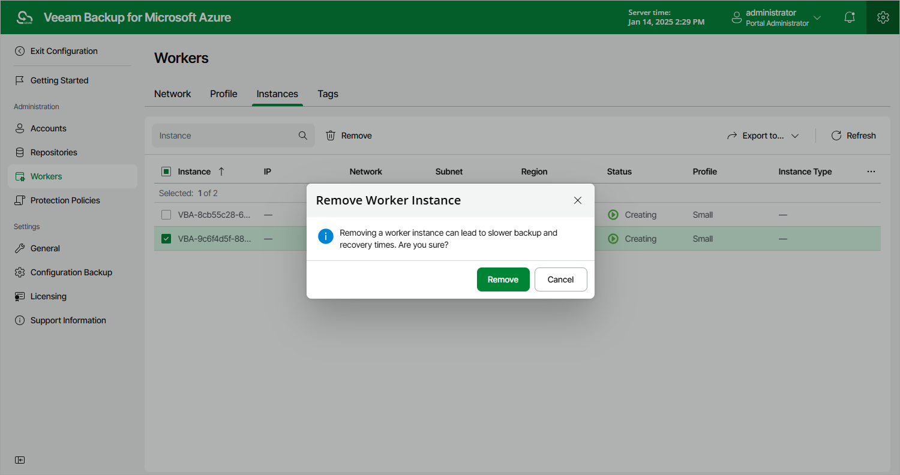

# Removing Worker Instances

Veeam Backup for Microsoft Azure allows you to permanently remove worker instances created based on worker configurations and profiles if you no longer need them.

To remove a worker instance from Veeam Backup for Microsoft Azure, do the following:

1. Switch to the Configuration page.
2. Navigate to Workers > Instances.
3. Select the worker instance and click Remove.

|  |
| --- |
| Note |
| If the selected worker instance is currently involved in a backup or restore process, it will be removed only when the process completes. |

Page updated 2023-11-10

