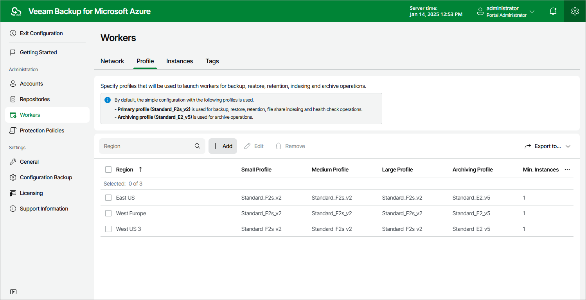

# Step 1. Launch Add Worker Profiles Wizard

To launch the Add Worker Profiles wizard, do the following:

1. Switch to the Configuration page.
2. Navigate to Workers > Profile.
3. Click Add.

Page updated 2023-11-09

