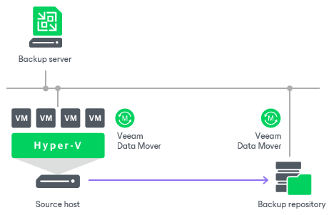
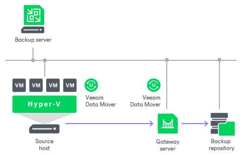
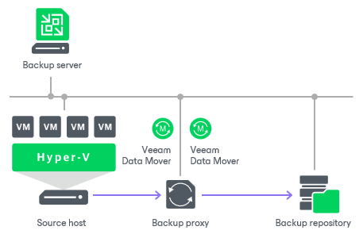
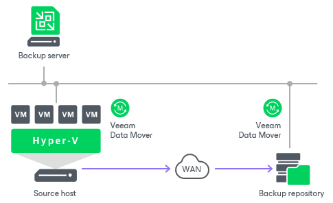
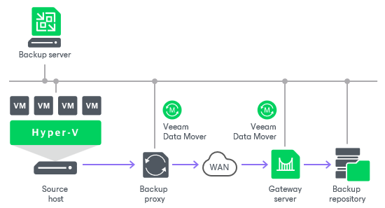

# Backup Infrastructure for Backup

Veeam Backup & Replication uses the following components for the backup process:

* One or more source hosts with associated volumes
* [Optional] Off-host backup proxy
* Backup repository
* [Optional] One or more guest interaction proxies
* [For shared folder backup repository] Gateway server

All backup infrastructure components engaged in the job make up a data pipe. The source host and backup repository produce two terminal points for the data flow. Veeam Backup & Replication processes VM data in multiple cycles, moving VM data over the data pipe block by block.

Veeam Backup & Replication collects VM data, transforms and transports it to the target with the help of [Veeam Data Movers](veeam_transport_service.md). Veeam Backup & Replication uses two-service architecture — one Veeam Data Mover controls interaction with the source host and the other controls interaction with the backup repository. Veeam Data Movers communicate with each other and maintain a stable connection.

When a new backup session starts, Veeam Backup & Replication performs the following actions:

1. Veeam Backup & Replication deploys non-persistent runtime components or, if necessary, persistent agent components on VM guest OSes using the guest interaction proxy (for Microsoft Windows VMs) or backup server (for VMs with other OSes).
2. The target-side Veeam Data Mover obtains job instructions and communicates with the source-side Veeam Data Mover to begin data collection.
3. The source-side Veeam Data Mover copies VM data from the volume shadow copy or VM checkpoint. During incremental job runs, the source-side Veeam Data Mover retrieves only those data blocks that have changed since the previous job session.

While copying, the source-side Veeam Data Mover performs additional data processing. It filters out zero data blocks, blocks of swap files and blocks of excluded VM guest OS files; it compresses and deduplicates VM data blocks and moves them to the target-side Veeam Data Mover.

1. The target-side Veeam Data Mover deduplicates similar blocks of data on the target side and writes the result to the backup file in the backup repository.

On-Site Backup

When you back up to a Microsoft Windows or Linux-based backup repository in the local site, Veeam Backup & Replication starts the target-side Veeam Data Mover on the Microsoft Windows or Linux repository. The source-side Veeam Data Mover can be hosted on the source host or a dedicated off-host backup proxy, depending on the backup mode you use (on-host or off-host). VM data is sent from the source host to the backup repository over the LAN.

To back up to a shared folder backup repository in the local site, you need to deploy a gateway server with access to the shared folder backup repository. You can assign the role of a gateway server to the backup server itself or any Microsoft Windows machine added to the backup infrastructure. In this scenario, Veeam Backup & Replication starts the target-side Veeam Data Mover on the gateway server. The source-side Veeam Data Mover can be hosted on the source host or a dedicated off-host backup proxy, depending on the backup mode you use (on-host or off-host).

If you choose to back up VMs to a shared folder backup repository and do not specify a gateway server explicitly, Veeam Backup & Replication starts the source-side and target-side Veeam Data Movers on the backup proxy. In the on-host backup scenario, Veeam Data Movers are started on the source Microsoft Hyper-V host. In the off-host backup scenario, Veeam Data Movers are started on the off-host backup proxy.

Off-Site Backup

The common requirement for off-site backup is that one Veeam Data Mover runs in the production site, closer to the source volume, and the other Veeam Data Mover runs in the remote target site, closer to the backup repository. During backup, Veeam Data Movers maintain a stable connection, which allows for uninterrupted operation over WAN or slow links.

If you choose to back up to a Microsoft Windows or Linux repository in the remote site, Veeam Backup & Replication starts the target-side Veeam Data Mover on the Microsoft Windows or Linux repository. The source-side Veeam Data Mover can be hosted on the source host or a dedicated off-host backup proxy, depending on the backup mode you use (on-host or off-host). VM data is sent from the source to the backup repository over the WAN.

If you choose to back up to a shared folder backup repository in the on-host mode, you must deploy a gateway server in the remote site and point the shared folder backup repository at this gateway server. In this scenario, Veeam Backup & Replication starts the target-side Veeam Data Mover on the gateway server. The source-side Veeam Data Mover can be hosted on the source host or a dedicated off-host backup proxy in the source site, depending on the backup mode you use (on-host or off-host).

Related Topics

* [Backup Infrastructure Components](components.md)
* [Data Compression and Deduplication](compression_deduplication_hv.md)

