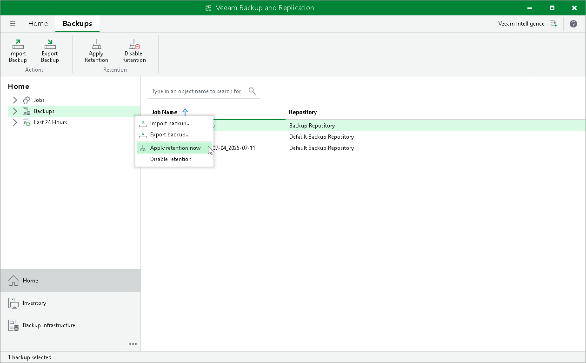

# Launching Background Retention

In this article

Veeam Backup & Replication launches [background retention](background_retention_job_hv.md) every 24 hours at 00:30. If you need to free up disk space from outdated backups earlier, you can launch the background retention manually.

To launch the background retention outside its automatic schedule, do the following:

1. Open the Home view.
2. In the inventory pane, right-click the Backups node.
3. Select Apply retention now or click Apply Retention on the ribbon.

Related Links

* [Background Retention](background_retention_job_hv.md)
* [Disabling Background Retention](backup_background_retention_disable_hv.md)

Page updated 2/18/2025

Page content applies to build 13.0.1.1071
