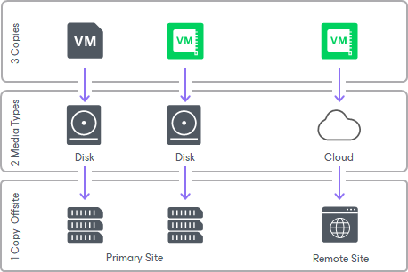

# Backup Copy

In this article

The main backup purpose is to protect your data against disasters and virtual or physical machine failures. However, having just one backup does not provide the necessary level of safety. The primary backup may get destroyed together with production data, and you will have no backups from which you can restore data.

To build a successful data protection and disaster recovery plan, it is recommended that you follow the 3-2-1 rule:

* 3: You must have at least three copies of your data: the original production data and two backups.
* 2: You must use at least two different types of media to store the copies of your data, for example, local disk and cloud.
* 1: You must keep at least one backup off-site, for example, in the cloud or in a remote site.

Thus, you must have at least two backups and they must be in different locations. If a disaster takes out your production data and local backup, you can still recover from your off-site backup.

To help you adopt the 3-2-1 rule, Veeam Backup & Replication offers backup copy capabilities. Backup copy allows you to create several instances of the same backup data in different locations, whether on-site or off-site. Backup copies have the same format as those created by backup jobs and you can recover your data from them when you need it.

Backup copy is a job-driven process. Veeam Backup & Replication fully automates the backup copy process and lets you specify retention settings to maintain the desired number of restore points, as well as full backups for archival purposes.

Related Topics

* [About Backup Copy](about_backup_copy.md)
* [Creating Backup Copy Jobs for VMs and Physical Machines](backup_copy_create.md)
* [Linking Backup Jobs to Backup Copy Jobs](linking_backup_to_copy.md)
* [Removing Backups](backup_copy_remove_backups.md)
* [Removing Missing Restore Points](backup_copy_remove_missing_point.md)

Page updated 3/17/2025

Page content applies to build 13.0.1.1071
