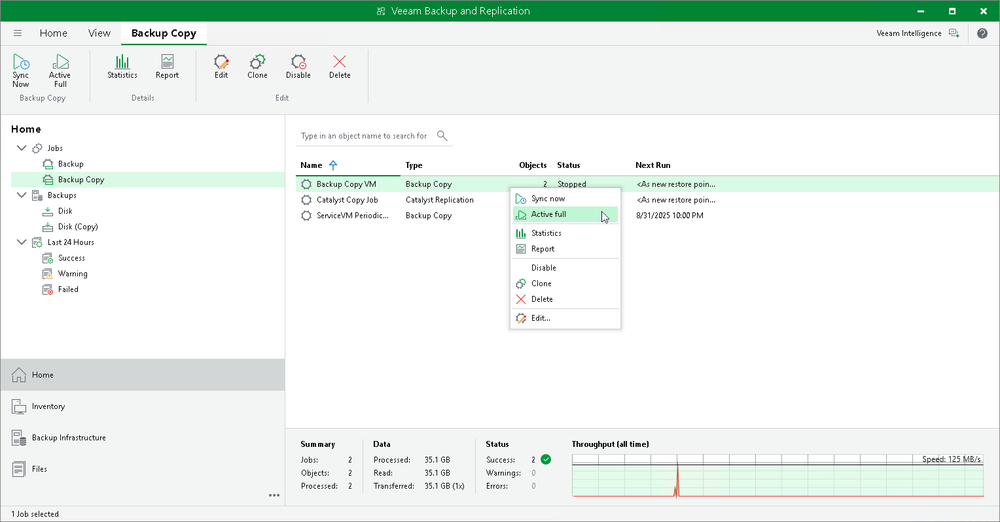

# Active Full Backup Copies

In this article

You can manually create an ad-hoc full backup for the backup copy job — active full backup copy, and add it to the backup chain in the target backup repository. To do this, you can use the Active Full button on the ribbon or the Active Full command from the shortcut menu.

Active full backup copy can be helpful if you want to change backup copy job settings, for example, enable or disable encryption. Veeam Backup & Replication will apply new settings starting from this full backup.

Veeam Backup & Replication treats archive full backups created with the active full backup method as regular backups and applies regular retention policy rules to maintain the necessary number of restore points.

Retention Policy for Active Full Backups

If you create active full backups for backup copy jobs, Veeam Backup & Replication applies to the backup chain retention rules of the forward incremental backup method. Veeam Backup & Replication waits until the number of restore points in the new backup chain is equal to the retention policy setting, and then removes the previous backup chain on the whole. For more information, see [Forward Incremental Backup Retention Policy](retention_incremental.md).

Related Topics

[Creating Active Full Backups](backup_copy_active_full_create.md)

Page updated 8/31/2025

Page content applies to build 13.0.1.1071
