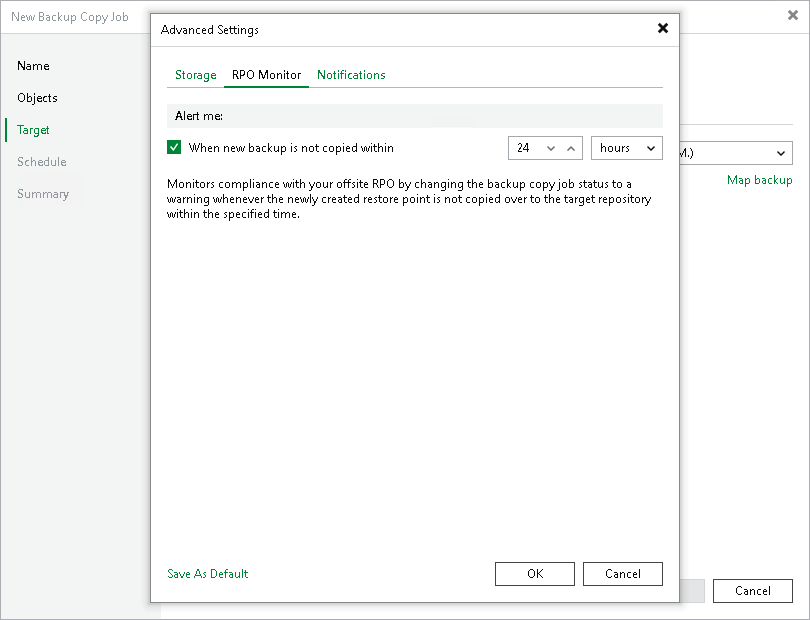

# RPO Warning Settings

In this article

At the RPO Monitor tab, specify RPO warning settings.

Enable the Warn me if backup is not copied within check box and specify the time period in minutes, hours, or days.

If the backup copy is not created within the specified time period, the backup copy job will finish with the Warning status. The countdown starts from the moment when the required backup is finished and ready to be copied.

Page updated 5/7/2025

Page content applies to build 13.0.1.1071
