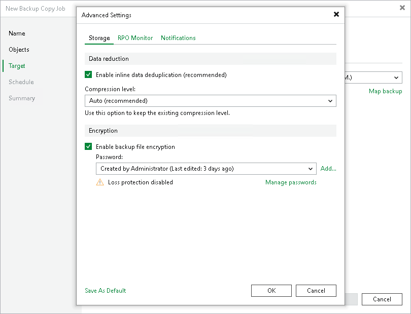

# Storage Settings

In this article

At the Storage tab, define compression and deduplication settings.

By default, Veeam Backup & Replication performs deduplication before storing copied data on the target backup repository. Deduplication provides a smaller size of the resulting backup file but may reduce the job performance.

1. You can disable data deduplication. To do this, clear the Enable inline data deduplication check box.
2. From the Compression level list, choose a compression level to be used: Auto, None, Dedupe-friendly, Optimal, High or Extreme. The recommended level of compression for backup copy jobs is Auto. In this case, Veeam Backup & Replication uses compression settings of the copied backup files. For more information, see [Compression and Deduplication](compression_deduplication.md).
3. To encrypt the content of backup copy files, select the Enable backup file encryption check box. In the Password field, select a password that you want to use for encryption. If you have not created the password beforehand, click Add or use the Manage passwords link to specify a new password. For more information, see [Password Manager](password_manager.md).

If the backup server is not connected to Veeam Backup Enterprise Manager, you will not be able to restore data from encrypted backups in case you lose the password. Veeam Backup & Replication will display a warning about it. For more information, see [Decrypting Data Without Password](decrypt_without_pass.md).

You can select a Key Management System (KMS) server in the Password field. To do this, the KMS server must be added to Veeam Backup & Replication in advance. If you choose to use KMS keys for backup file encryption at this step of the wizard, Veeam Backup & Replication immediately starts communication with the KMS server to retrieve the encryption keys. To learn more, see [Key Management System Keys](kms.md).

|  |
| --- |
| Note |
| When specifying encryption settings, consider the following:   * To enable encryption for an existing backup copy job, you must disable a backup copy job. Otherwise, you cannot reconfigure the Enable backup file encryption check box.   After you enable encryption and enable the backup copy job, Veeam Backup & Replication applies new settings only starting from the next backup session (created manually or by the GFS schedule). The next created backup file will be encrypted with the specified password.   * Encryption is not retroactive. If you enable encryption for an existing job, Veeam Backup & Replication does not encrypt the previous backup chain created with this job. If you want to start a new chain so that the unencrypted previous chain can be separated from the encrypted new chain, follow the scenario described in [this Veeam KB article](https://www.veeam.com/kb1885). |

Page updated 5/7/2025

Page content applies to build 13.0.1.1071
