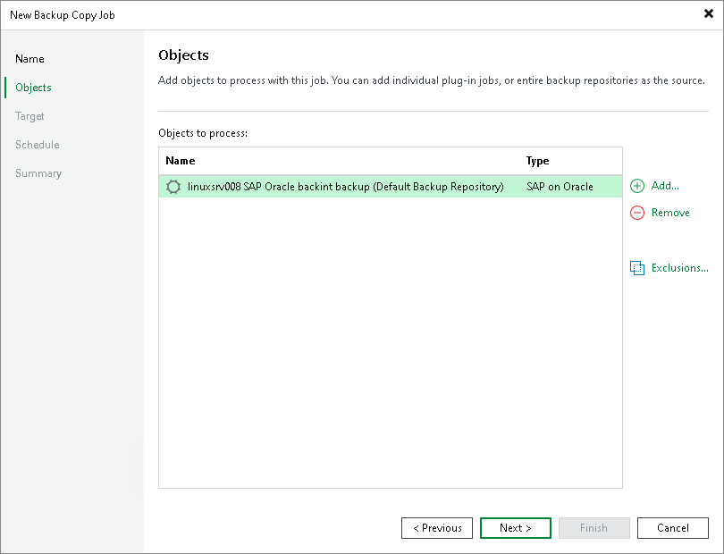

# Step 3. Select Backups to Process

In this article

At the Object step of the wizard, select machines whose backups you want to copy to the target repository.

1. Click the Add button and select from which entity you want to process the machines.

* From jobs: You can select Veeam Plug-In backup jobs. When a backup copy job runs, Veeam Backup & Replication will search for backup files created by selected jobs.
* From repositories: You can select repositories where Veeam Plug-In backups are stored. When a backup copy job runs, Veeam Backup & Replication will search for backup files created by Veeam Plug-In in selected repositories.

1. Use the Remove button if you want to remove selected jobs or repositories from processing.
2. If you have added jobs from a repository and want to exclude from processing some of the backup jobs on the selected repository, click Exclusions and select the jobs that you want to exclude.

Page updated 7/30/2023

Page content applies to build 13.0.1.1071
