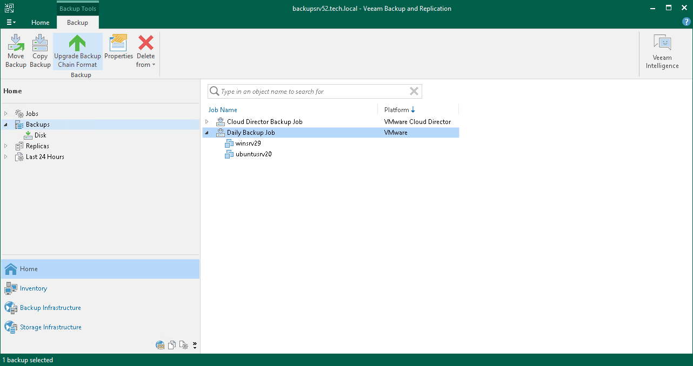

# Upgrading Backup Chain Formats

Veeam Backup & Replication supports the following ways to store backup files: per-machine backup with separate metadata files, per-machine backup with single metadata file and single-file backup. For more information, see [Backup Chain Formats](per_vm_backup_files.md).

Changing the Use per-machine backup files option for existing backup repositories or [moving backups](move_backup.md) to other repositories does not change the backup chain format. To change the format, follow the instructions in this section.

|  |
| --- |
| Note |
| Consider the following:   * Before upgrading the backup chain format of backup copy backups, upgrade the backup chain format of source backups first. * [For immediate copy mode] If the backup chain is mixed, consists of single-file backups and per-machine backups with single metadata file, and the last part is per-machine backups with single metadata file, you cannot change the backup chain format. You need to wait until the backup chain becomes per-machine.  * Before upgrading the backup chain format, Veeam Backup & Replication disables the job to which the backups belong. After the upgrade, the job stays disabled, you need to enable it manually.  * You must disable log backup jobs manually before changing the format.  * [For format upgrade using mapping] During the upgrade, Veeam Backup & Replication synthesizes full backups in the per-machine backup with separate metadata files format using the existing backup (the source for mapping). That is why you need enough space on the repository to store full backups. After the successful change operation, the backup used as the source for mapping is placed to the node with the (Orphaned) postfix. After the successful upgrade, you can delete this orphaned backup. * [For periodic copy mode] You can not upgrade the backup chain format of Windows agent failover cluster backups.  * You can stop an upgrade session only for the backups for which the session has not started. If the session has started, Veeam Backup & Replication continues the upgrade to avoid backup corruption. * You cannot upgrade the backup chain format for backups stored on repositories with rotated drives. |

Immediate Copy Mode: Per-Machine Backup with Single Metadata File to Per-Machine with Separate Metadata Files

To upgrade the backup chain format from per-machine backup with single metadata file to per-machine backup with separate metadata files, use the upgrade functionality:

1. Open the Home view.
2. In the inventory pane, select the Backups node.
3. In the working area, select the necessary backup copy jobs. Note that the selected jobs must be targeted to the same repository.
4. Right-click one of the selected jobs and click Upgrade backup chain format. Alternatively, click Upgrade Backup Chain Format on the ribbon.

Veeam Backup & Replication will generate new metadata files for the existing backups. After the upgrade, the job will continue the backup chain and will create per-machine backups with separate metadata files.

Immediate Copy Mode: Single-File Backup to Per-Machine with Separate Metadata Files

To upgrade the backup chain format from single-file backup to per-machine backup with separate metadata files, do the following:

1. Detach backups from the backup copy job for whose backups you want to change the backup chain format. For more information, see [Detaching Backups from Jobs](detach_backup.md).
2. Edit the backup copy job from which you have detached backups.
3. At the Target step of the wizard, map the backup copy job to the detached backups as described in section [Map Backup File](backup_copy_mapping_file_job.md).

Alternatively, you can create a new backup copy job as described in subsection [Periodic Copy Mode](#periodic_copy_mode).

Veeam Backup & Replication will start a new backup chain in the required format and will retain the detached backups according to the background retention. For more information on when the background retention applies, its limitations and considerations, see [Background Retention](background_retention_job.md).

Periodic Copy Mode

To upgrade the backup chain format for the periodic copy mode, do the following:

1. Create a new backup copy job.
2. At the Objects step of the wizard, select the same sources as in the backup copy job whose backups you want to upgrade. Note that you can also add other sources.
3. At the Target step of the wizard, select the backup repository where the backups whose format you want to change are stored.
4. At the Target step of the wizard, map the backup copy job to the backups as described in section [Map Backup File](backup_copy_mapping_file_job.md).

Veeam Backup & Replication will start a new backup chain in the required format and will place the backups used for mapping to the orphaned node and retain them according to the background retention. For more information on when the background retention applies, its limitations and considerations, see [Background Retention](background_retention_job.md).

