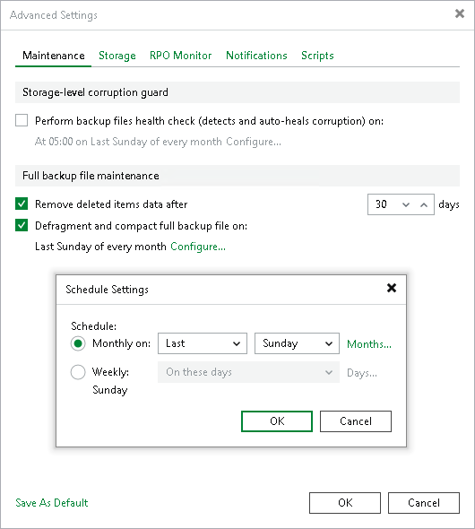

# Compact of Full Backup File

In this article

The backup copy job constantly transforms the full backup file in the backup chain to meet retention policy settings. The transformation process, however, has a side effect. In the long run, the full backup file grows large and gets fragmented. The file data occurs to be written to non-contiguous clusters on disk, and operations of reading and writing data from and to the backup file slow down.

To resolve the fragmentation problem, you can instruct Veeam Backup & Replication to compact the full backup file periodically. During the file compact operation, Veeam Backup & Replication creates a new full backup file in the target repository: it copies existing data blocks from the old backup file, rearranges and stores them close to each other. As a result, the full backup file gets defragmented, its size reduces and the speed of reading and writing from and to the file increases.

To compact the full backup file periodically, you must enable the Defragment and compact full backup file option in the backup copy job settings and define the compact operation schedule. By default, the compact operation is performed on the last Sunday of every month. You can change the compact operation schedule and instruct Veeam Backup & Replication to perform it weekly or monthly on specific days.

Related Topics

[Creating Backup Copy Jobs for VMs and Physical Machines](backup_copy_create.md)

Page updated 8/31/2025

Page content applies to build 13.0.1.1071
