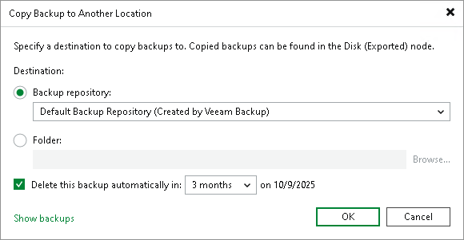

# Copying Backups

In this article

Copying backups can be helpful if you want to copy backups of a workload or backup job to another repository, local or shared folder. Veeam Backup & Replication copies the whole backup chain. If you want to convert a specific restore point into a single VBK file, use backup export. For more information, see [Exporting Backups](exporting_backups.md).

When Veeam Backup & Replication performs the copy operation, it disables the job, copies files to the target location and then enables the job. After the copy operation finishes, the copied backups are shown in a node with the (Exported) postfix in the inventory pane.

|  |
| --- |
| Note |
| This section is about one-time copy operation. If you want to copy backups on a schedule, create a backup copy job. For more information, see [Backup Copy](backup_copy.md). |

Requirements and Limitations

Consider the following:

* The copy operation does not change the [backup chain format](per_vm_backup_files.md) (single-file backup, per-machine with single metadata file or per-machine with separate metadata files). If you copy backups between repositories with and without the Use per-machine backup files check box enabled, backups preserve their formats.

* If you copy backups from a scale-out backup repository and some backups are stored on extents in the Maintenance mode, such backups are not copied.

* If you copy a backup chain to a repository with different immutability or retention settings, Veeam Backup & Replication will replace the source repository settings with the settings of the target repository for that specific backup chain.

* Veeam Backup & Replication copies backups only from the performance tier of the scale-out backup repository. If you want to copy data from the capacity tier, you first must download it to the performance tier. For more information, see [Downloading Data from Capacity Tier](downloading_from_capacity_tier.md).

* You cannot copy backups between extents of a scale-out backup repository. To learn how to manage backups within the scale-out backup repository, see [Scale-Out Backup Repositories](backup_repository_sobr.md).

* You cannot copy backups stored in Veeam Cloud Connect repositories. For more information on Veeam Cloud Connect repositories, see the [Cloud Repository](https://helpcenter.veeam.com/docs/vbr/cloud/cloud_connect_repository.html?ver=13) section in the Veeam Cloud Connect Guide.
* The Copy backup operations to, from and between cloud repositories are not supported. For more information on Veeam Cloud Connect's limitations, see the [Veeam Cloud Connect Backup](https://helpcenter.veeam.com/docs/vbr/cloud/cloud_connect_limitations.html?ver=13) section in the Veeam Cloud Connect Guide.
* [For VMware Cloud Director] You can copy backups of a whole job or individual vApps. You cannot move backups of VMs.
* You cannot copy backups created by a backup job managed by Veeam Agent (backup policy).

* You cannot copy backups created by [Veeam Plug-Ins for Enterprise Applications](protect_applications.md), Veeam Cloud Plug-ins ([Veeam Backup for AWS](https://helpcenter.veeam.com/docs/vbaws/guide/overview.html?ver=10), [Veeam Backup for Google Cloud](https://helpcenter.veeam.com/docs/vbgc/guide/welcome.html?ver=7)\*, [Veeam Backup for Microsoft Azure](https://helpcenter.veeam.com/docs/vbazure/guide/overview.html?ver=8.1)), and [Veeam Kasten](https://helpcenter.veeam.com/docs/vbr/kasten_integration/overview.html?ver=13).

\* Available only for Microsoft Windows-based backup servers.

* [Traffic throttling](setting_network_traffic_throttling.md) is not supported for backup copy operations.

Copying Backups

To copy backups, do the following:

1. Open the Home view.
2. In the [inventory pane](vbr_ui.md), select the Backups node.
3. In the working area, select the necessary job or workload. Note that you can copy backups of an individual workload only if its backups are [per-machine backups](per_vm_backup_files.md) with separate metadata files.
4. Right-click the job and select Copy backup. Alternatively, click Copy Backup on the ribbon.
5. In the Copy Backup to Another Location window, choose where you want to copy backups — to a repository or to a local or shared folder.
6. If you want to delete the copied backups after a specific time period, select the Delete this backup automatically in check box and specify the time period.

Backups that fall out of the specified retention policy will be removed automatically. If you do not specify the time period for deletion, copies will be stored until you remove them manually.

|  |
| --- |
| Tip |
| You can customize retention period values in the drop-down list as described in [this Veeam KB article](https://www.veeam.com/kb4537). |

1. Click OK.

Managing Failed Activities

If the copy operation fails, Veeam Backup & Replication assigns the User action required status to it. In this case, you need to decide how to finish the operation: retry the copy operation for failed backups, skip the failed backups or cancel all changes.

|  |
| --- |
| Note |
| The original job will still be in the disabled state until you finalize the failed copy operation. |

To finalize the copy operation:

1. Open the Home view.
2. In the inventory pane, select the Last 24 Hours node.
3. Right-click the failed copy session and select the required action. Alternatively, select the required action on the ribbon.

Page updated 1/25/2024

Page content applies to build 13.0.1.1071
