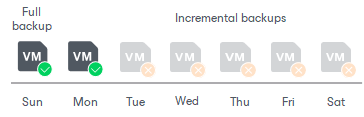
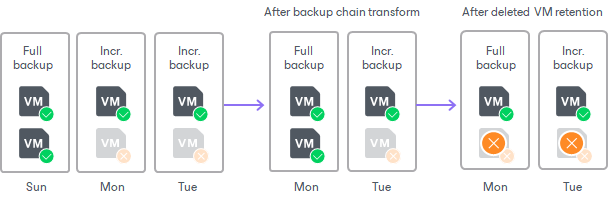

# Deleted Items Retention

In this article

After you configure a backup copy job, you may want to change something in the virtual infrastructure. For example, you may remove some virtual or physical machines or move VMs to another location. You may also exclude VMs from the backup copy job that has already run for some time.

By default, when you remove a machine protected by Veeam Backup & Replication from the virtual infrastructure, exclude a machine from the backup copy job or stop protecting a machine with Veeam Agent, the copied data still remains in backup files in the target backup repository. To avoid keeping redundant data on disk, you can enable the Remove deleted items data after option in the backup copy job advanced settings. With this option enabled, at the end of every synchronization cycle Veeam Backup & Replication will remove data for deleted machines from backup files in the target backup repository.

Veeam Backup & Replication removes data for deleted machine only if two conditions are met:

1. Veeam Backup & Replication has not created a valid restore points for the deleted machine for the number of days specified in the Remove deleted items data after field.
2. The backup chain in the target backup repository does not contain any successful incremental restore points for the deleted machine.

This approach helps ensure that data for deleted machines can be saved by the GFS retention.

For example:

* The retention for the backup copy job is set to 7.
* The retention period for deleted machine is set to 3 days.

The backup copy job has created 3 successful restore points — a full backup and two incremental backups. During the next 4 days, no successful restore points were created. At the next synchronization cycle, Veeam Backup & Replication will not remove data for the deleted machine from the target backup repository as the backup chain contains successful incremental restore points for this machine.

|  |
| --- |
| Important |
| Consider the following:   * The deleted items retention applies only to regular backup chains. Veeam Backup & Replication does not remove data for deleted machines from weekly, monthly and yearly backups. * [For single-file backups] When Veeam Backup & Replication removes data for deleted machines from regular backup chains, it does not free up space in the backup repository. It marks the space as available to be overwritten, and this space is overwritten during subsequent job sessions or the backup file compact operation. * When Veeam Backup & Replication removes data for deleted machines from per-machine backup chains, it does not mark the space as available but deletes backup files since they contain data for 1 machine only. |

Veeam Backup & Replication does not analyze the reason for which the machine has not been processed during the backup copy session. For example, a VM may be regarded as deleted if Veeam Backup & Replication has failed to obtain data for the VM from the virtual infrastructure, the VM has failed to be processed in time during the backup copy session and so on.

For this reason, you must be careful when specifying the retention period for deleted machines. If the retention period is too short, Veeam Backup & Replication may remove from the backup chain restore points that you still require.

For example, a backup copy job is configured to process 2 VMs and has the following settings:

* The backup copy starts once a day.
* The retention for the backup copy job is set to 2.
* The retention period for deleted VMs is set to 1 day.

The backup copy job runs in the following way:

1. On Sunday, the backup copy job creates a full backup for 2 VMs – VM1 and VM2.
2. On Monday, the backup copy job creates an incremental backup for VM1. The backup copy job does not manage to process VM2 in time.
3. On Tuesday, the backup copy job creates an incremental backup for VM1. The backup copy job does not manage to process VM2 in time.
4. At the end of the backup copy job session on Tuesday, Veeam Backup & Replication transforms the backup chain and detects deleted VMs. Veeam Backup & Replication regards VM2 as a deleted VM — the deleted VMs retention is set to 1 day, and after transformation, there are no valid restore points for this VM in the backup chain.

As a result, after the backup copy session on Tuesday backup files in the target backup repository will not contain data for VM2.

Page updated 8/31/2025

Page content applies to build 13.0.1.1071
