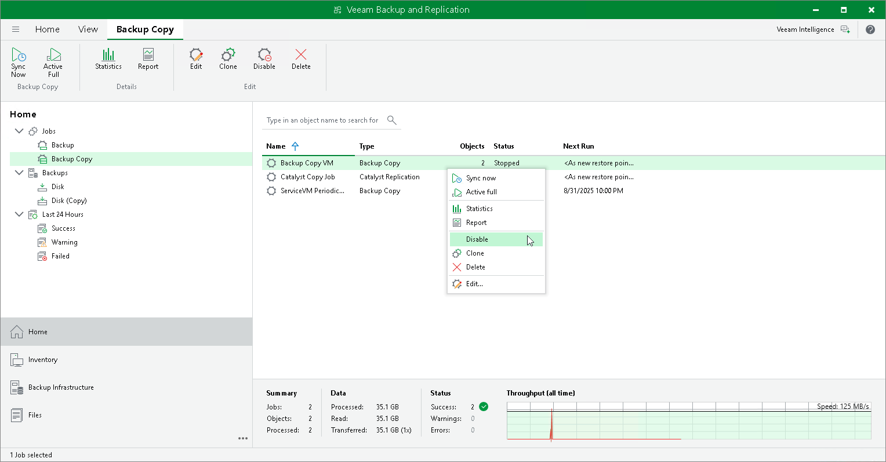

# Disabling and Deleting Backup Copy Jobs

You can temporarily disable backup copy jobs. The disabled job is paused for some period of time and is not run by the specified schedule. You can enable a disabled job at any time. You can also permanently delete a job from Veeam Backup & Replication and from the configuration database.

Disabling Job

To disable a job:

1. Open the Home view.
2. In the inventory pane, select Jobs > Backup Copy.
3. In the working area, select the job and click Disable on the ribbon or right-click the job and select Disable.

To enable a disabled job, select the job in the list and click Disable once again.

|  |
| --- |
| Note |
| If the [health check](backup_copy_health_check.md) is enabled in the job settings, it will continue to run according to its own schedule, regardless of the job status. |

Deleting Job

To delete a job:

1. Open the Home view.
2. In the inventory pane, select Jobs > Backup Copy.
3. In the working area, select the job, click Delete on the ribbon or right-click the job and select Delete.

|  |
| --- |
| Note |
| If you want to delete an active backup copy job, you must first stop the synchronization process. To do this, disable the backup job. After the job is disabled, you can delete it. |

After the job is deleted, the backups created by this job are displayed under the Backups > Disk (Orphaned) node. If the backup files created by this job were also stored in an object storage repository, they will also be displayed under the Backups > Object Storage (Orphaned) node.

