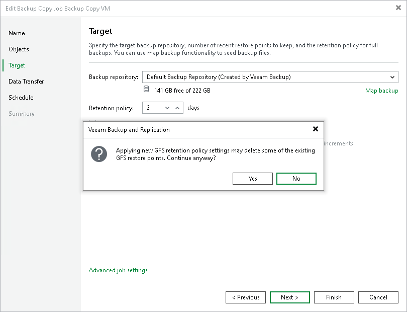

# Editing Backup Copy Job Settings

You can edit backup copy job settings after you create it. For example, you may want to change scheduling settings for the job or add some machines to the job.

To edit job settings:

1. Open the Home view.
2. In the inventory pane, select Jobs > Backup Copy.
3. In the working area, select the job and click Edit on the ribbon or right-click the job and select Edit.

You will follow the same steps as you have followed when creating the job and can change job settings as required.

Related Topics

* [Creating Backup Copy Jobs for VMs and Physical Machines](backup_copy_create.md)
* [Creating Backup Copy Jobs for HPE StoreOnce Repositories](backup_copy_hpe_storeonce.md)
* [Creating Backup Copy Jobs for Veeam Plug-Ins](backup_copy_plugins.md)

Disabling GFS Scheme

If you disable the Keep certain full backups longer for archival purposes option, and you already have archive full backups in the target backup repository, Veeam Backup & Replication will offer you to remove existing archive full backups.

* Click Yes to remove archive full backups from the target backup repository. Archive full backups will be removed during the next retention cycle (next backup copy session). The backup copy job will not create archive full backups.
* Click No to keep archive full backups in the target backup repository. Archive full backups will be displayed under the Backups > Disk (Imported) node in the Veeam Backup & Replication console. The backup copy job will not create archive full backups.

|  |
| --- |
| Note |
| If you disable the Keep certain full backups longer for archival purposes option and enable it again later, archive full backups that remained on disk will not be linked to the backup copy job. They will still be displayed under the Backups > Disk (Imported) node in the Veeam Backup & Replication console. |

