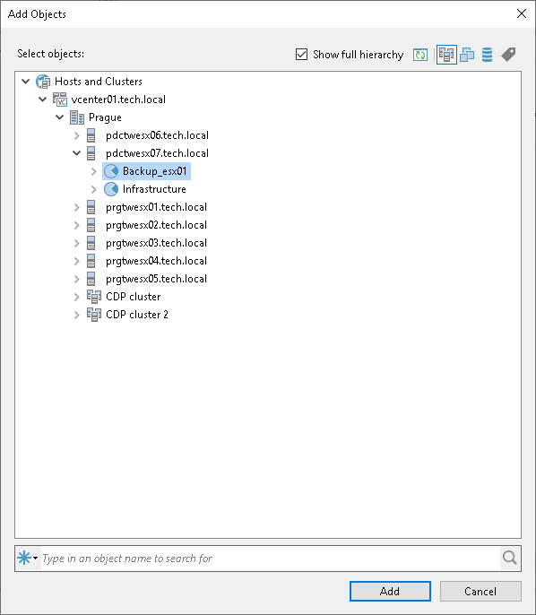

# Step 4. Exclude Objects from Backup Copy Job

In this article

This option is available only for virtual machines.

To specify which objects you want to exclude from the backup copy job:

1. At the Objects step of the wizard, select the source object and click Exclusions.
2. In the Exclusions window, click Add.

If you have added repositories as sources of restore points, you can exclude individual VMs or backup jobs from processing. To exclude individual VMs, click Add > Objects. To exclude individual jobs, click Add > Jobs.

1. In the Add Objects window, select objects that you want to exclude.

When you exclude VMs, you can use the Show full hierarchy check box to display the hierarchy of all hosts added to Veeam Backup & Replication.

1. Click Add.
2. Click OK.

Page updated 8/31/2025

Page content applies to build 13.0.1.1071
