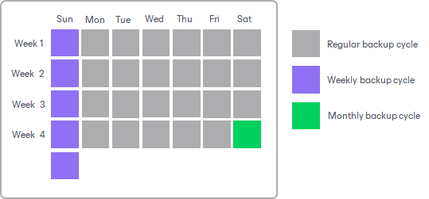

# Long-Term Retention Policy (GFS)

The long-term or Grandfather-Father-Son (GFS) retention policy allows you to store VM backups for long periods of time — for weeks, months and years. For this purpose, Veeam Backup & Replication creates [synthetic or active](backup_copy_gfs_modes.md) full backup files and marks them with GFS flags. These GFS flags can be of three types: weekly, monthly or yearly. Depending on which flag is assigned to the full backup, it will be stored for specified number of weeks, months or years.

The GFS retention also helps you to mitigate risks that the [short-term retention policy](backup_copy_simple_retention.md) has, such as large number of subsequent incremental backups. Large number of subsequent incremental backups can increase recovery time, because Veeam Backup & Replication has to read data through the whole backup chain. Also, one corrupted increment can make the whole chain useless. When you configure the GFS retention, Veeam Backup & Replication creates weekly/monthly/yearly full backups, so instead of one backup chain consisting of one full backup and incremental backups, you will have several backup chains.

GFS backups are always full backup files that contain data of the whole machine image as of a specific date. GFS is a tiered retention policy and it uses a number of cycles to retain backups for different periods of time:

* Weekly backup cycle
* Monthly backup cycle
* Yearly backup cycle

In the GFS retention policy, weekly backups are known as ‘sons’, monthly backups are known as ‘fathers’ and yearly backups are known as ‘grandfathers’. Weekly, monthly and yearly backups are also called archive backups.

|  |
| --- |
| Note |
| GFS retention policy functions in combination with [short-term retention policy](backup_copy_simple_retention.md). After you enable the GFS retention, the backup chain switches from the forever-forward incremental policy to [forward incremental policy](forward_incremental_backup.md). Thus, the increments are no longer merged to the full backup file.  If you enable only yearly full backups without monthly and weekly backups, this can result in a large number of increments in a backup chain. To avoid this, it is recommended to enable an additional weekly GFS cycle. Weekly GFS cycle will update the backup chain every week which will allow Veeam Backup & Replication to remove excessive increment files. |

Related Topics

* [How GFS Retention Works](backup_copy_how_to_gfs.md)
* [Limitations and Considerations for GFS Retention Policy](backup_copy_considerations.md)

