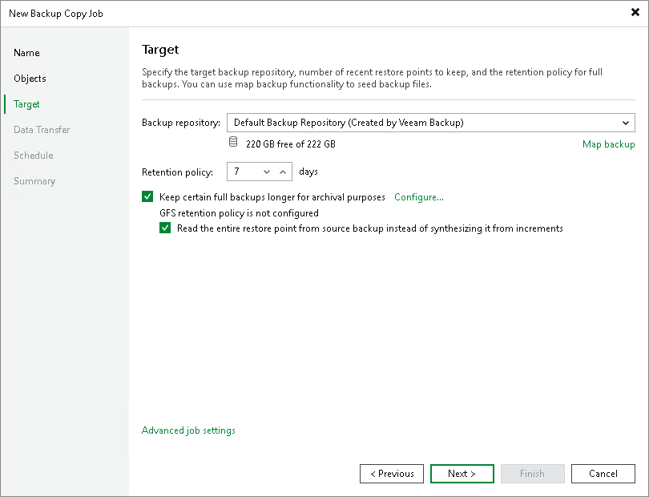

# Backup Copy GFS Methods

In this article

You can instruct Veeam Backup & Replication to create archive full backups with the following methods:

* [Synthetic full method](backup_copy_gfs_modes.md#synth) — Veeam Backup & Replication synthesizes archive full backups using restore points in the target backup repository.
* [Active full method](backup_copy_gfs_modes.md#active) — Veeam Backup & Replication copies data for archive full backups from the source backup repository.

Synthetic Full Method for Archive Backups

The synthetic full backup is the default method to create archive full backups. Veeam Backup & Replication does not copy data for archive full backups from the source backup repository. It synthesizes archive full backups from backup files that are already stored in the target backup repository. This approach helps reduce load on the network and production environment.

|  |
| --- |
| Note |
| The synthetic full method is not recommended if you use a deduplication storage appliance as a target backup repository. Performing a synthetic full backup in such repositories requires additional time and resources to download and decompress backup data blocks.  It does not apply to HPE StoreOnce, Dell Data Domain and ExaGrid:   * HPE StoreOnce and Dell Data Domain use virtual synthetics. Veeam Backup & Replication creates archive full backups by virtually synthesizing data blocks from existing backup files. * ExaGrid uses adaptive deduplication. Veeam Backup & Replication creates archive full backups from existing backup files that are stored in complete form in ExaGrid high-speed cache. |

Active Full Method for Archive Backups

You can instruct Veeam Backup & Replication to create archive full backups (backups retained by the GFS scheme) with the active full backup method. The active full backup method is recommended if you use a deduplicating storage appliance as the target backup repository. Active full backup helps improve the backup copy job performance and reduce the load on the target backup repository.

By default, Veeam Backup & Replication uses the synthetic backup method to create archive full backups. However, synthesizing archive full backups can cause problems with storage performance on deduplicating storage appliances. Deduplicating storage appliances are optimized for sequential data access. The synthetic backup creation, however, takes random I/O operations — Veeam Backup & Replication reads data from existing backup files and writes data to the synthesized archive full backup file. As a result, the storage performance can degrade.

In addition, backups reside in the target backup repository in the deduplicated and compressed state. Before creating synthetic full backups, Veeam Backup & Replication needs to download and decompress data blocks of backups, which requires additional time and resources.

|  |
| --- |
| Note |
| Consider the following:   * The active full backup method does not always copy the most recent restore point from the source backup repository. If the recent restore point is not created by the time the GFS task must start, Veeam Backup & Replication copies the latest available restore point from the source backup repository. * If Veeam Backup & Replication does not manage to transfer the restore point according to backup copy schedule, Veeam Backup & Replication will finalize the transfer anyway. |

Related Topics

* [Backup Copy GFS Cycles](backup_copy_gfs_periods.md)
* [Backup Chain for GFS Backups](backup_copy_gfs_chain.md)

Page updated 9/15/2025

Page content applies to build 13.0.1.1071
