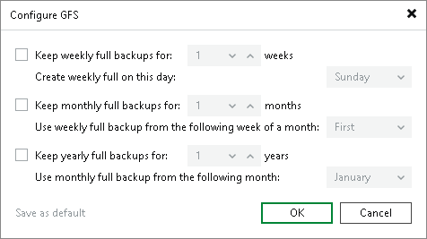

# Backup Copy GFS Cycles

In this article

When you configure the GFS schedule in the backup copy job settings, you specify for how long archive backups must be stored and on which day certain GFS backup must be created. You can configure the GFS schedule in the settings of a backup copy job. For details, see [Backup Copy Job: Define Backup Copy Target](backup_copy_target.md).

There are separate schedules for weekly, monthly and yearly full cycles. For details on settings of the GFS retention, see the following table.

| GFS Backup Option | Description |
| --- | --- |
| Weekly GFS cycle | If you want to create weekly full backups, select the Keep weekly full backups for check box. Then, specify the number of weeks during which the weekly backup must be stored on the target repository. During this period the weekly backup cannot be deleted or modified.  Veeam Backup & Replication creates a weekly full backup on the specified day of the week. On this day, creation of a weekly full backup starts as soon as the backup copy interval starts. |
| Monthly GFS cycle | To create monthly restore points, you can select the Keep monthly full backups for check box. Then, specify the number of months during which the monthly backup must be stored on the target repository. During this period the monthly backup cannot be deleted or modified.  Veeam Backup & Replication creates monthly full backups according to a schedule that depends on whether the weekly cycle is enabled or disabled:   * If weekly backups are enabled, Veeam Backup & Replication uses the weekly backup schedule and adds a monthly flag to the weekly backup. * If weekly backups are disabled, Veeam Backup & Replication creates monthly full backups on the first day of the selected week. You can select First, Second, Third, Fourth or Last week of a month. If you select First, monthly backups are created on the first day of each month. If you select Last, monthly backups are created on different dates depending on the number of days in a month:  + For 31 days: 25th of the month. + For 30 days: 24th of the month. + For 29 days: 23rd of the month. + For 28 days: 22nd of the month.   If the first day of the current week has already passed and you select the first week for the monthly full backup cycle, Veeam Backup & Replication creates a monthly full backup even if it is not the first day of the current week.  If you enable the monthly GFS cycle and select the first week that has already passed, Veeam Backup & Replication will create a monthly full backup only in the next month. Monthly full backup for the current month will not be created. |
| Yearly GFS cycle | If you want to create yearly restore points, select the Keep yearly full backups for check box. Then, specify the number of years during which the yearly backup must be stored on the target repository. During this period the yearly backup cannot be deleted or modified.  Veeam Backup & Replication creates yearly full backups according to a schedule that depends on whether the monthly cycle is enabled or disabled:   * If monthly backups are enabled, Veeam Backup & Replication uses the monthly backup schedule and adds a yearly flag to the monthly backup. * If monthly backups are disabled, Veeam Backup & Replication creates yearly full backups on the first day of the selected month.   If the first day of the current month has already passed and you select the current month for the yearly full backup cycle, Veeam Backup & Replication creates a yearly full backup even if it is not the first day of the current month.  If you enable the yearly GFS cycle and select the month that has already passed, Veeam Backup & Replication will create a yearly full backup only in the next year. Yearly full backup for the current year will not be created. |

|  |
| --- |
| Tip |
| If you want to save this set of settings as the default one, click Save as default. When you create a new job, the saved settings will be offered as the default. This also applies to all users added to the backup server. |

Page updated 8/31/2025

Page content applies to build 13.0.1.1071
