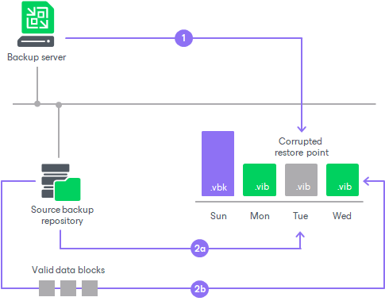

# Health Check for Backup Files

You can instruct Veeam Backup & Replication to periodically perform a health check for the latest restore point or backup file in the backup chain. The health check helps Veeam Backup & Replication make sure that further restore will be possible.

The health check starts according to the schedule. By default, the health check is scheduled to start at 5:00 on last Sunday of every month. The health check verifies restore points (full backup files or related full and incremental backup files). Only the latest restore points are verified.

|  |
| --- |
| Note |
| Consider the following:   * The health check process differs for HPE StoreOnce backup copy jobs. For more information, see [Health Check for HPE StoreOnce Backup Copy Jobs](#storeonce). * If you perform the health check for the encrypted backup files, Veeam Backup & Replication will pass encryption keys to the regular backup repository or cloud repository. For more information on encryption, see [Data Encryption](data_encryption.md). * If the backup copy job is still running when the health check is scheduled to run, the health check will start after the backup copy job finishes. |

How Health Check Works

Veeam Backup & Replication performs the health check in the following way:

1. Veeam Backup & Replication calculates CRC values for backup metadata and hash values for data blocks of a disk in the backup file and saves these values in the metadata of the backup file, together with copied data.
2. On the day when the health check is scheduled, Veeam Backup & Replication performs the following actions:

1. Veeam Backup & Replication performs the health check for the latest restore point in the backup chain. If the latest restore point in the backup chain is incomplete, Veeam Backup & Replication checks the restore point preceding the latest one.

Veeam Backup & Replication calculates CRC values for backup metadata and hash values for disks data blocks in the backup file and compares them with the CRC and hash values that are already stored in the backup file.

1. If the health check detects corrupted data blocks, together with data blocks for the new restore point, Veeam Backup & Replication transports valid data blocks for the corrupted restore point. The valid data blocks are stored to the new incremental restore point created by this backup copy session. As a result, the backup chain gets “fixed”, and you get a possibility to restore data from restore points following the corrupted restore point.

Health Check for HPE StoreOnce Backup Copy Jobs

The health check starts as soon as a backup copy job transfers backup files to the target repository. The health check verifies backup files, not restore points, and only those backup files transferred during the current job session.

Veeam Backup & Replication performs the health check in the following way:

1. As soon as a backup file is transferred to the target repository, Veeam Backup & Replication calls the HPE StoreOnce internal method that calculates checksums for data blocks of this backup file.

The checksum calculation requires the rehydration of the verified data. This may lower the performance on the target repository especially during the first backup copy session. During this session, the health check verifies all backup files in target backup chains.

1. Veeam Backup & Replication compares the calculated checksums and the checksums already stored in the backup file.
2. If the health check detects corrupted data blocks, Veeam Backup & Replication deletes the backup file from the target repository. On the next backup copy job session, Veeam Backup & Replication transfers and performs the health check for this file again.

