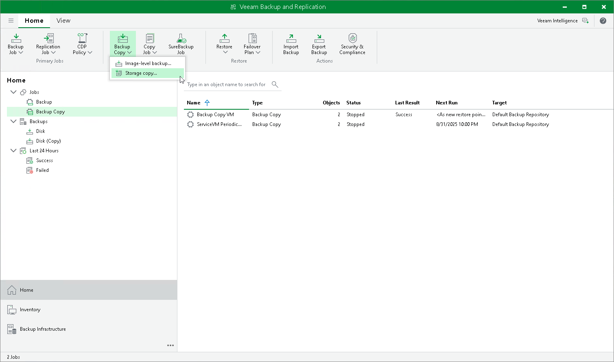

# Step 1. Launch New Backup Copy Job Wizard

To run the New Backup Copy Job wizard, do one of the following:

* On the Home tab, click Backup Copy and click Storage copy.
* Open the Home view, in the inventory pane right-click Jobs or right-click anywhere in the working area, click Backup Copy and click Storage copy.

