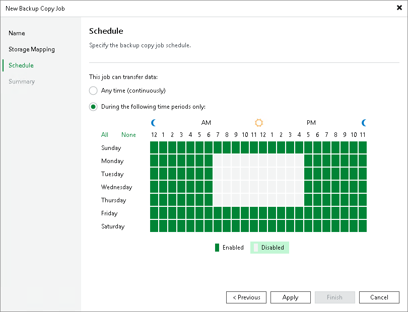

# Step 5. Define Backup Copy Window

At the Schedule step of the wizard, you can define a time span in which the backup copy job will transport data between source and target backup repositories. For more information, see [Backup Copy Window](backup_copy_window.md#immediate).

To define a 'prohibited' period for the backup copy job:

1. Select the During the following time periods only option.
2. In the schedule box, select the desired time area.
3. Use the Enabled and Disabled options to mark the selected time segments as allowed or prohibited for the backup copy job.

Related Topics

[Backup Copy Window](backup_copy_window.md)

