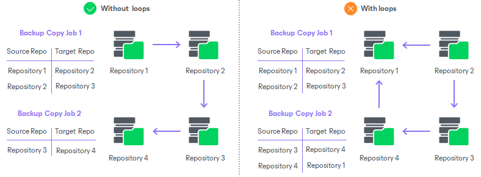
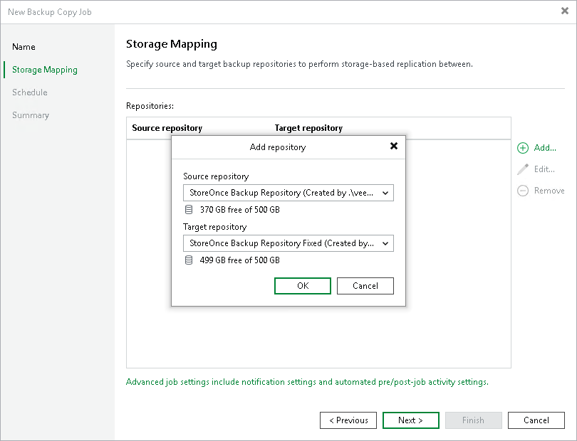

# Step 3. Select Source and Target Repositories

At the Storage Mapping step of the wizard, select a source repository from which you want to copy backups and a target repository where you want to store the copies.

1. Click Add to open the Add Repository window.
2. From the Source backup repository list, select a backup repository from which you want to copy backup files. The unsupported backup repositories are not shown in the list.
3. From the Target backup repository list, select a backup repository where you want to store the copies. The unsupported backup repositories are not shown in the list.

|  |
| --- |
| Important |
| Veeam Backup & Replication does not copy all types of backups. For the list of supported backup types, see [Creating Backup Copy Jobs for HPE StoreOnce Repositories](backup_copy_hpe_storeonce.md). |

Requirements and Limitations for Source and Target Repositories

When you create backup copy jobs, check the following prerequisites and limitations for the source and target repositories:

* The source and target backup repositories must be HPE StoreOnce backup repositories or scale-out backup repositories that consist of HPE StoreOnce repositories only.
* [For scale-out backup repositories] The file placement policy must be Data locality. For more information, see [Data locality](backup_repository_sobr_placement.md#locality).
* Within one backup copy job, you can use each repository as a source only once.
* You must not create the same pairs of source and target repositories, even in different backup copy jobs.

Requirements for Data Flow

When you create backup copy jobs, check that you do not create loops in data flow across all backup copy jobs. This means that data copied from one repository must not be copied to it again. The following image shows backup copy jobs configured correctly (without loops) and incorrectly (with loops).

