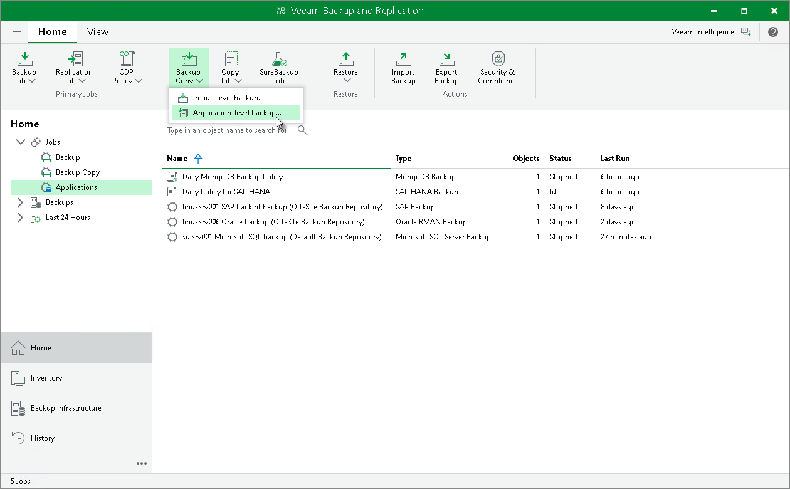

# Step 1. Launch Backup Copy Job Wizard

In this article

To create a backup copy job, do the following:

1. In the Veeam Backup & Replication console, open the Home view.
2. Click Backup Copy on the ribbon and select Application-level backup.

Page updated 11/28/2024

Page content applies to build 13.0.1.1071
