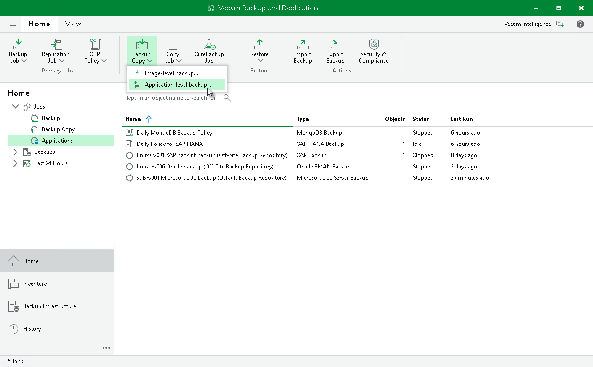

# Step 1. Launch Backup Copy Job Wizard

To create a backup copy job, do the following:

1. In the Veeam Backup & Replication console, open the Home view.
2. Click the Backup Copy tab and select Application-level backup.

