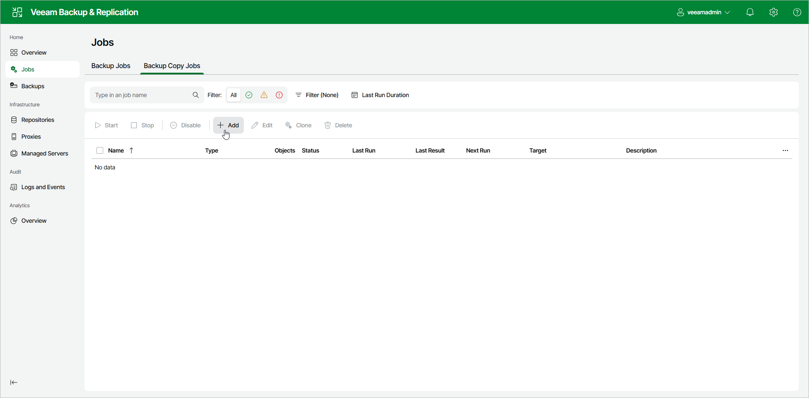

# Step 1. Launch New Backup Copy Job Wizard

In this article

To run the New Backup Copy Job wizard:

1. In the management pane under the Home section, click Jobs.
2. Select Backup Copy Jobs.
3. Click Add on the ribbon.

Page updated 8/11/2025

Page content applies to build 13.0.1.1071
