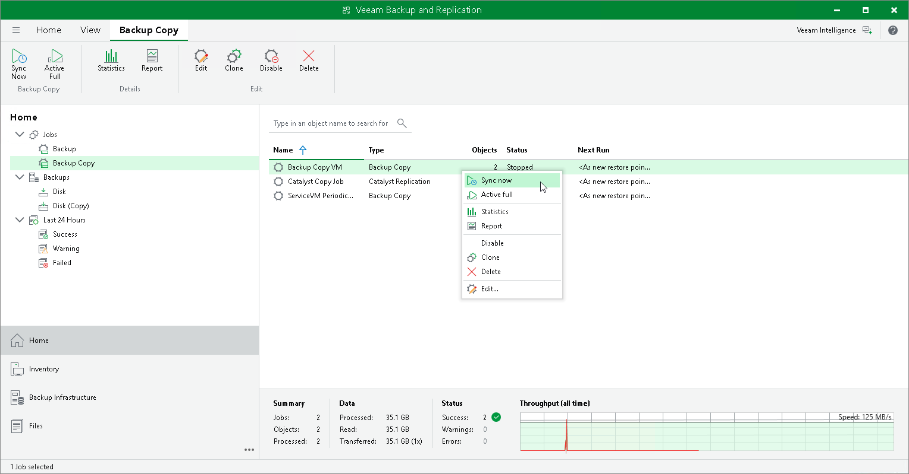
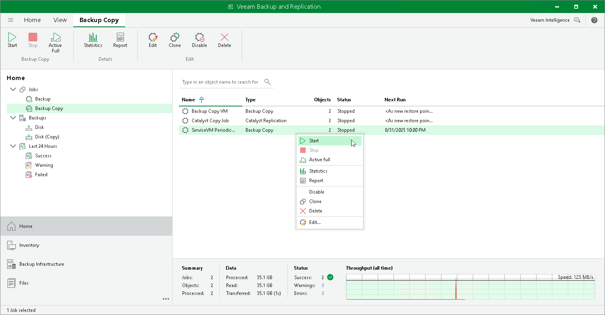
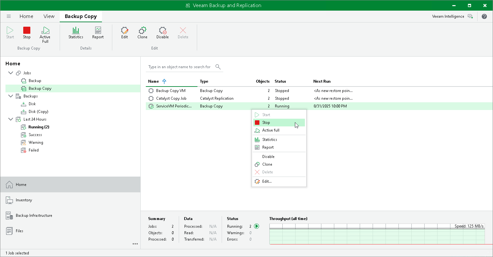

# Starting and Stopping Backup Copy Jobs

Manual start can be helpful if the backup copy job was disabled for some time and restore points were not copied to the target repository. This procedure differs for the periodic and immediate copy modes. You can also manually stop the periodic backup copy job. For more information, see the following sections:

* [Starting Jobs in Immediate Copy Mode](#immediate)
* [Starting Jobs in Periodic Copy Mode](#periodic)
* [Stopping Jobs in Periodic Copy Mode](#periodic_stop)

|  |
| --- |
| Note |
| The immediate backup copy job can only be disabled and can not be stopped. |

Starting Jobs in Immediate Copy Mode

To start the backup copy job manually:

1. Open the Home view.
2. In the inventory pane, select the Backup Copy node.
3. In the working area, select the backup copy job and click Sync now on the ribbon or right-click the backup copy job and select Sync now.
4. In the opened window, do the following:

* If you want to copy all restore points created by the source jobs but that were not copied since the last backup copy job session, click All.
* If you want to copy only the latest restore point for each source job, click Latest.

Starting Jobs in Periodic Copy Mode

To start the backup copy job manually:

1. Open the Home view.
2. In the inventory pane, select the Backup Copy node under Jobs.
3. In the working area, select the backup copy job and click Start on the ribbon or right-click the backup copy job and select Start.

Stopping Jobs in Periodic Copy Mode

To stop the backup copy job manually:

1. Open the Home view.
2. In the inventory pane, select the Backup Copy node under Jobs.
3. In the working area, select the backup copy job and click Stop on the ribbon or right-click the backup copy job and select Stop.

Related Topics

* [Backup Copy Modes](backup_copy_modes.md)

