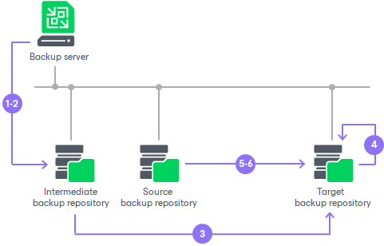

# Creating Seed for Backup Copy Job

Backup copy jobs have limitations for backups that can be used as seeds. The limitations are listed in section [Map Backup File](backup_copy_mapping_file_job.md).

To create a seed for the primary backup copy job, do the following:

1. Create a backup copy job. Add jobs or repositories whose restore points you want to copy to this backup copy job. Target the backup copy job to some backup repository on the source side. This backup repository will be used as an intermediate one.
2. Run the backup copy job to create a full backup file (VBK) in the intermediate backup repository.
3. Transfer the created VBK file and VBM file from the intermediate backup repository to the target backup repository.
4. Perform [repository rescan](rescanning_backup_repositories.md) to populate the target backup repository.

If the initial backup file was encrypted, you must enter a password to unlock the full backup file. Otherwise, Veeam Backup & Replication will not display the full backup file in the list of backups in the backup repository. For more information, see [Importing Encrypted Backups](import_encrypted.md).

1. Remap the backup copy job to the full backup file that you have created and transferred to the target backup repository.

As a result, Veeam Backup & Replication will use the full backup file as a seed. When a new restore point for the machine is available in the source backup repository, Veeam Backup & Replication will copy the restore point to the target backup repository and store it next to the full backup seed.

