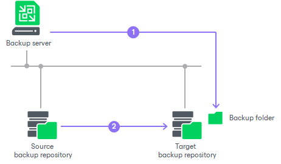

# Backup Copy Job Mapping

Backup copy job mapping helps you reduce the amount of data transferred over network and decrease the load on WAN accelerators or slow connections. You can also use mapping to upgrade from legacy backup chain formats to per-machine backup with separate metadata files format. For more information, see [Backup Chain Formats](per_vm_backup_files.md).

[For legacy periodic backup copy job] If you use the target backup repository also as a target for other backup copy or backup jobs, you can already have a backup of machines that you want to copy. In this case, you can map the backup copy job to this backup.

A backup copy job mapped to a backup is performed in the following way:

1. Veeam Backup & Replication accesses a backup to which you map the backup copy job. The backup may have any number of restore points in the chain. This backup chain will be used as a seed for the further backup copying process.
2. During subsequent backup copy sessions, Veeam Backup & Replication copies restore points in a regular manner. It copies only incremental changes and stores them as new restore points next to the seed backup chain.

A mapped backup copy job does not store copied restore points in a dedicated folder in the target backup repository. Instead, it stores restore points to the same folder where the "seed" backup chain resides.

Related Topics

[Creating a Seed for the Backup Copy Job](backup_copy_mapping_auxiliary.md)

