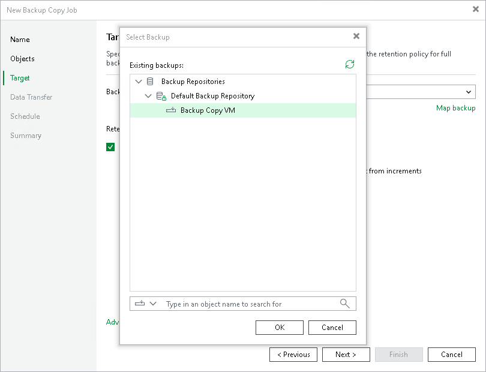

# Step 6. Map Backup File

In this article

If the target backup repository already stores a backup of workloads that you want to copy, you can map the backup copy job to this backup.

The backup copy job will use the backup as a seed. As a result, Veeam Backup & Replication will transfer less data over network. For more information, see [Backup Copy Job Mapping](backup_copy_mapping_file.md).

To map the backup copy job to a backup:

1. At the Target step of the wizard, click the Map backup link.
2. In the Select Backup window, select a backup that contains restore points of workloads that you want to copy.

Limitations for Mapping

When mapping a backup copy job, consider the following limitations:

* If a backup that you plan to use as a seed is encrypted, you must enable encryption for the backup copy job. The password that you use for the backup copy job can differ from the password used for the initial job.
* The following limitations apply to a backup that can be used as a seed:

* You can map the backup copy job created in Veeam Backup & Replication 12 or later only to a backup created by a backup copy job.
* You can map the backup copy job created in Veeam Backup & Replication 12 or later only to the per-machine backup file.

Page updated 11/21/2025

Page content applies to build 13.0.1.1071
