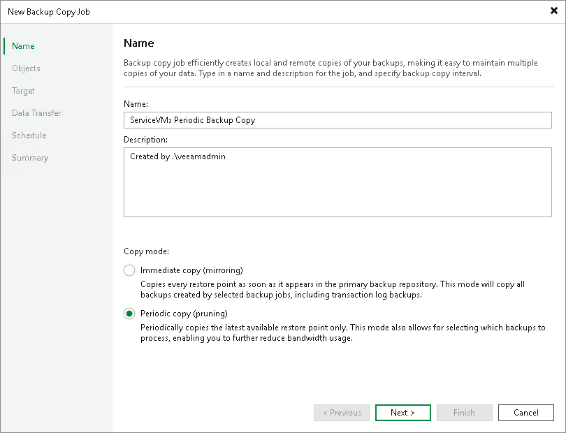

# Step 2. Specify Job Name and Copy Mode

At the Job step of the wizard, specify basic settings for the backup copy job:

1. In the Name field, specify a name for the job.
2. In the Description field, provide a description for the job.

The default description contains information on a user who created the job, date and time when the job was created.

1. Select a backup copy mode. For more information on copy modes and backup types supported in each mode, see [Backup Copy Modes](backup_copy_modes.md).

* Select Immediate copy to copy new restore points and, if required, log backups as soon as they appear.

* Select Periodic copy to copy the most recent restore points.

|  |
| --- |
| Note |
| Backup copy job in the immediate copy mode processes only the latest backup file chain. To make such jobs copy all existing backups, create the BackupCopyMirrorAll value in the in the configuration file on the Linux-based backup server. For the Microsoft Windows-based backup server, create BackupCopyMirrorAll (REG\_MULTI\_SZ) registry value under the HKLM\SOFTWARE\Veeam\Veeam Backup and Replication key. Populate this value with the names of backup copy jobs. Ensure that the value is created before the specified jobs are run for the first time. |

