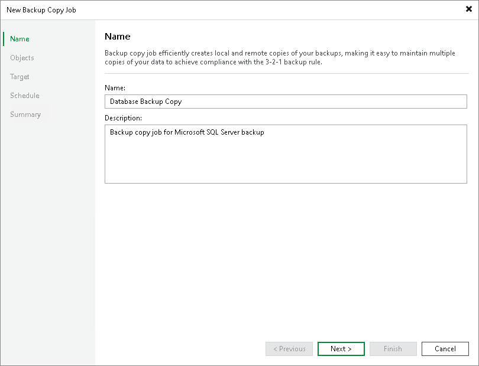

# Step 2. Specify Job Name and Description

At the Job step of the wizard, specify a name and description for the backup copy job.

1. In the Name field, enter a name for the job.
2. In the Description field, enter a description for the job. The default description contains information about the user who created the job, date and time when the job was created.

