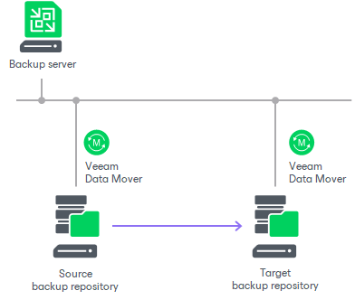
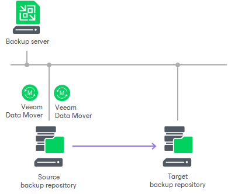
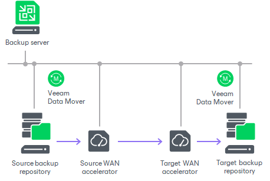

# Backup Copy Architecture

To transport data from the source backup repository to the target backup repository, the backup copy job uses one of the following paths:

* [Direct transport path](backup_copy_path.md#direct)
* [Transport path over WAN accelerators](backup_copy_path.md#wan)

Direct Transport Path

Veeam Backup & Replication transports data directly from the source backup repository to the target backup repository. This type of data transport is recommended for copying backups to on-site backup repositories or off-site backup repositories over fast connections.

When Veeam Backup & Replication transports data over the direct data path, it uses Veeam Data Movers on the following backup infrastructure components:

* Microsoft Windows and Linux repositories. Veeam Backup & Replication uses the source Veeam Data Mover on the source backup repository and target Veeam Data Mover on the target backup repository.

* Shared folder backup repository. If you have instructed Veeam Backup & Replication to automatically select the gateway server, Veeam Backup & Replication will use Veeam Data Movers deployed on mount servers associated with backup repositories. In case mount servers cannot be used for some reason, Veeam Backup & Replication will fail over to the backup server.

If you have explicitly defined the gateway server, Veeam Backup & Replication will use the source Veeam Data Mover on the gateway server in the source site and target Veeam Data Mover on the gateway server on the target site.

* Object storage repository. If you have not explicitly defined the gateway server, Veeam Backup & Replication will use both source and target Veeam Data Movers on the source backup repository site.

If you have explicitly defined the gateway server, Veeam Backup & Replication will use the source Veeam Data Mover on the gateway server in the source site and target Veeam Data Mover on the gateway server on the target site.

Transport Path over WAN Accelerators

Veeam Backup & Replication transports data through a pair of WAN accelerators: one deployed on the source side and the other one deployed on the target side. WAN accelerators remove redundant blocks before transferring data and thus significantly reduce the amount of traffic going over the network. This type of data transport is recommended for copying backups off-site over slow connections or WAN.

|  |
| --- |
| Important |
| The availability of the feature depends on the license you use. For more details about licensing support, see [Veeam Data Platform Feature Comparison](https://www.veeam.com/veeam_data_platform_feature_comparison_ds.pdf). |

When Veeam Backup & Replication transports data using WAN accelerators, it uses Veeam Data Movers on the following backup infrastructure components:

* Microsoft Windows and Linux repositories. Veeam Backup & Replication uses the source Veeam Data Mover on the source backup repository and target Veeam Data Mover on the target backup repository.
* Shared folder backup repository. If you have instructed Veeam Backup & Replication to automatically select the gateway server, Veeam Backup & Replication will use Veeam Data Mover deployed on the source and target WAN accelerator. If you have explicitly defined the gateway server, Veeam Backup & Replication will use the source Veeam Data Mover on the gateway server in the source site and target Veeam Data Mover on the gateway server on the target site.

