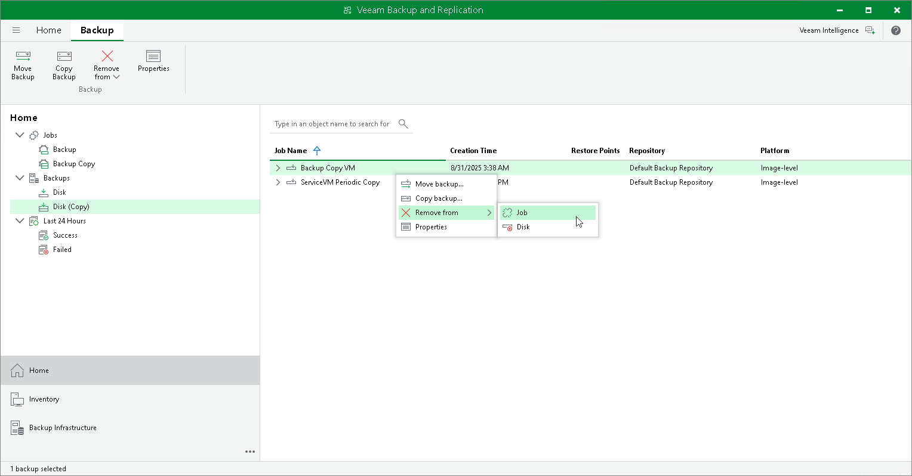

# Removing Backups

You can detach backups from backup copy jobs, permanently delete backups from the target backup repositories or remove records about backups from the Veeam Backup & Replication console and configuration database using the Remove from configuration operation.

Detaching from Job

When you detach backup copies from a backup job, the job stops processing these backup files. During the next run, the job will start a new backup chain, that is, will create active full backup.

Veeam Backup & Replication detaches the whole backup chain including GFS backups. The detached backup files remain in the backup repository and also in the Veeam Backup & Replication console. Veeam Backup & Replication shows the detached backups in the inventory pane in the node with the (Orphaned) postfix. These backups are retained according to the background retention process. For more information, see [Background Retention](background_retention_job.md).

To detach backups from a backup copy job:

1. Open the Home view.
2. In the inventory pane, select Backups > Disk (Copy).
3. In the working area, right-click the backup copy job and click Remove from > Job.

Deleting from Disk

When you use the Delete from disk option, you delete records about backup copies from the Veeam Backup & Replication console and configuration database, and delete backup files from the target backup repository. This option can be used for the whole backup copy or for some workloads in the backup copy.

|  |
| --- |
| Important |
| For scale-out backup repositories the Delete from disk operation will remove the backups not only from the performance tier but also from the capacity and archive tier. If you want to remove backups from the performance tier only, you should move those backups to the capacity tier instead. For details, see [Manually Moving Backups to Capacity Tier](moving_to_capacity_tier.md). |

To permanently remove backup copies from the target backup repository:

1. Open the Home view.
2. In the inventory pane, select Backups > Disk (Copy).
3. In the working area, right-click the backup copy job or a workload in the backup copy and click click Remove from > Disk.
4. To remove all weekly, monthly, quarterly and yearly backups from disk, select the Remove GFS full backups check box and click Yes.

Removing Backups from Configuration

|  |
| --- |
| Important |
| Removing backups from configuration is designed for experienced users only. Consider using Detach from job or Delete from disk operations.  Create [encrypted configuration backup](config_backup_encrypted.md) before removing backups from configuration. |

When you remove a backup from the configuration, backup files remain in the backup repository. You can import the backup to Veeam Backup & Replication at any time later and restore data from it.

When you remove an encrypted backup from configuration, Veeam Backup & Replication removes encryption keys from the configuration database. If you import such backup on the same backup server or another backup server, you will have to specify the password or unlock the backup with Veeam Backup Enterprise Manager. For more information, see [Importing Encrypted Backups](import_encrypted.md).

To remove a backup from the configuration:

1. Open the Home view.
2. In the inventory pane, select Backups > Disk (Copy).
3. In the working area, press the [Ctrl] key, right-click the backup that you want to remove and select Remove from > Configuration.

