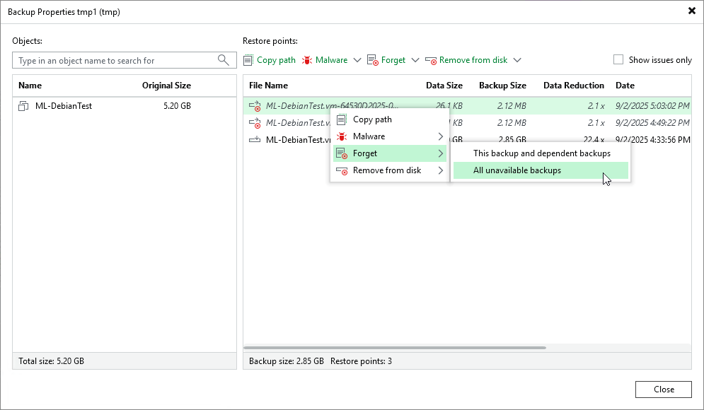
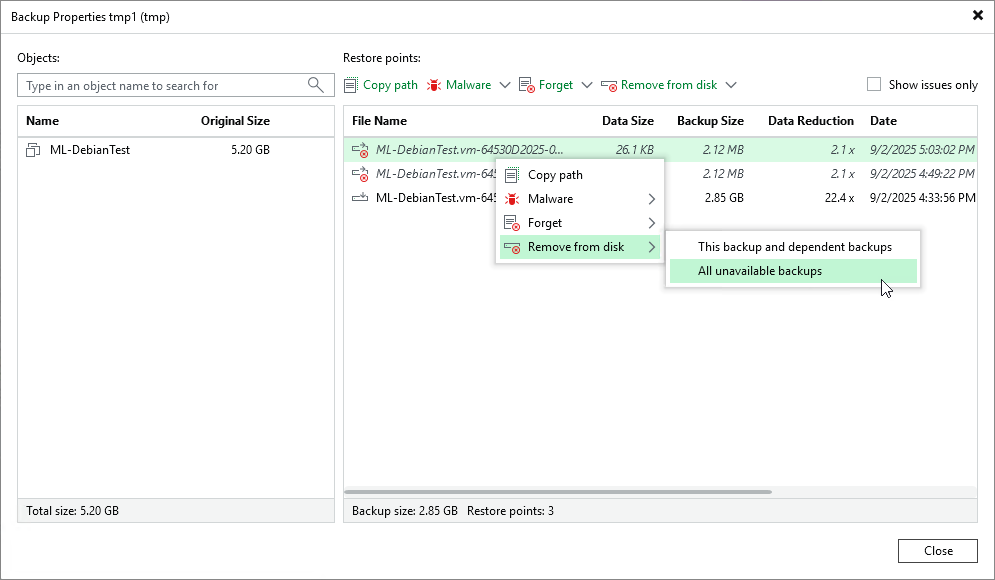

# Removing Missing Restore Points

In this article

In some cases, one or more restore points in the backup chain may be inaccessible. This can happen, for example, if the backup repository is put to the Maintenance mode (for scale-out backup repositories), the backup repository is not available or some backup file is missing in the backup chain. Backup chains that contain missing restore points get corrupted — you cannot perform backup copy or restore data from the missing restore point, and restore points that depend on the missing restore point.

You can perform the following with missing restore points:

* [Forget](backup_copy_remove_missing_point.md#forget) — you can remove records about missing restore points from the configuration database. Veeam Backup & Replication will ignore the missing restore points and will not display them in the console. The backup files will remain on disk (if backup files are still available).
* [Remove](#delete) — you can remove records about missing restore points from the Veeam Backup & Replication console and configuration database, and delete backup files from disk (if backup files are still available).

|  |
| --- |
| Note |
| Consider the following:   * The Forget and Remove from disk options are available only for restore points that are missing from the backup chain or that depend on missing ones.  * You can manually update information about missing restore points. For this, disable a backup copy job and rescan the backup repository that is the target for the backup copy job. For more information, see [Disabling and Deleting Backup Copy Jobs](backup_copy_disabling_jobs.md) and [Rescanning Backup Repositories](rescanning_backup_repositories.md).   Manual update can be required because Veeam Backup & Replication requires some time to update information in the configuration database for restore points that were removed from a backup chain or became inaccessible. That is why such restore points may not be displayed in the console as missing restore points. |

To remove records about missing restore points from the configuration database:

1. Open the Home view.
2. In the inventory pane, select Disk (copy) under Backups.
3. In the working area, select the backup and click Properties on the ribbon or right-click the backup and select Properties.
4. In the Backup Properties window, right-click the missing restore point and select Forget.

+ To remove only the selected restore point and restore points that depend on it (that is, a part of the backup chain starting from this restore point), select This and dependent backups.
+ To remove all missing restore points, select All unavailable backups.

To remove missing restore points from the configuration database and disk:

1. Open the Home view.
2. In the inventory pane, click Disk (copy) under Backups.
3. In the working area, select the backup and click Properties on the ribbon or right-click the backup and select Properties.
4. In the Backup Properties window, right-click the missing restore point and select Remove from disk.

+ To remove only the selected restore point and restore points that depend on it (that is, a part of the backup chain starting from this restore point), select This and dependent backups.
+ To remove all missing restore points, select All unavailable backups.

Page updated 9/3/2025

Page content applies to build 13.0.1.1071
