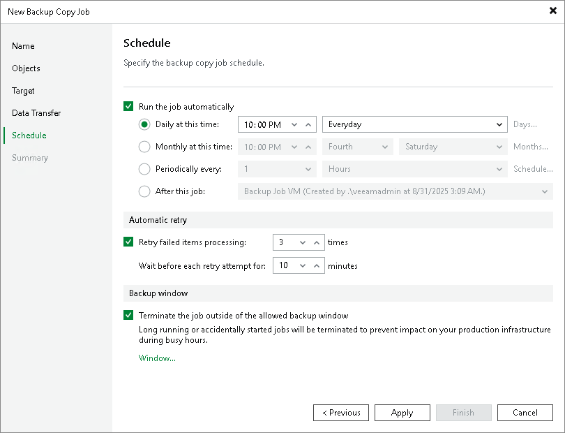

# Step 9. Define Backup Copy Window

At the Schedule step of the wizard, you can define a time span in which the backup copy job will transport data between source and target backup repositories. For more information, see [Backup Copy Window](backup_copy_window.md#immediate).

To define a backup window for the periodic backup copy job:

1. Select the Run the job automatically check box.
2. Select the required schedule option:

* Daily at this time. You can specify the time and select the days option from the drop-down list on which the backup copy job will run: Everyday, On weekdays or On these days. If you select the On these days option, click Days to specify them.
* Monthly at this time. You can specify the time and select the day options from the drop-down lists on which the backup copy job will run. Click Months to specify months on which the backup copy job will run.
* Periodically every. You can select the time options from the drop-down list or click Schedule to select the desired time area. Use the Permitted and the Denied options to mark the selected time segments. Use the Start time within an hour option to specify minutes.
* After this job. If you choose this option, select the job from the drop-down list after which the backup copy job will start.

1. To configure the backup copy job automatic retries, select the Retry failed items processing check box and specify the amount of retries and time intervals between them.
2. Select the Terminate job if it exceeds allowed backup window check box if you want the job to terminate itself to prevent performance impact during production hours. Click Window to select the desired backup window time area. Use the Permitted and Denied options to mark the selected time segments.

To define a backup window for the immediate backup copy job:

1. Select when the job can transfer data:

* Any time
* During the following time periods only

1. If you selected the During the following time periods only option, specify the required backup window option. Use the Enable and Disable options to mark the selected time segments as allowed or prohibited for the backup copy job.

Related Topics

[Backup Copy Window](backup_copy_window.md)

