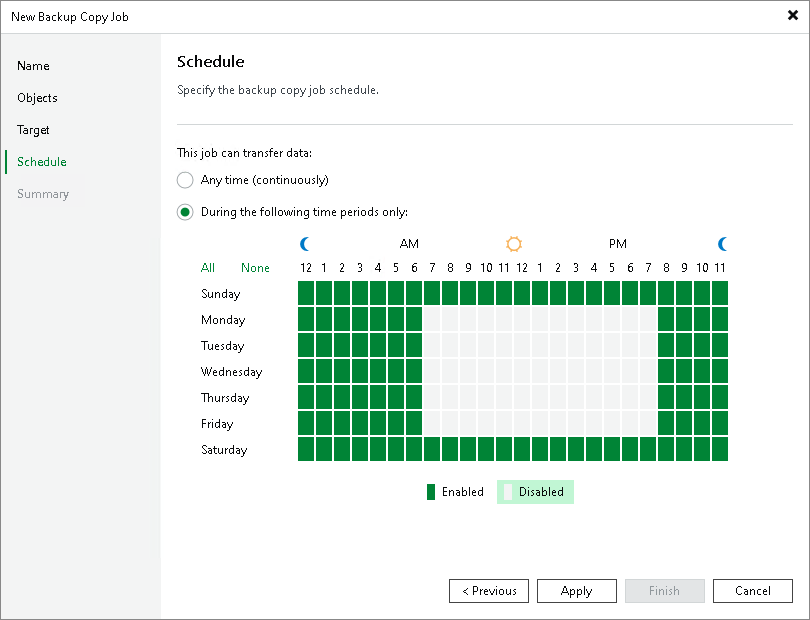

# Step 6. Define Backup Copy Schedule

In this article

At the Schedule step of the wizard, define a time span in which the backup copy job must not transport data between source and target backup repositories. For more information, see [Backup Copy Window](backup_copy_window.md).

To define a backup window for the backup copy job:

1. Select the During the following time periods only option.
2. In the schedule box, select the desired time area.
3. Use the Enable and Disable options to mark the selected area as allowed or prohibited for the backup copy job.

Page updated 5/7/2025

Page content applies to build 13.0.1.1071
